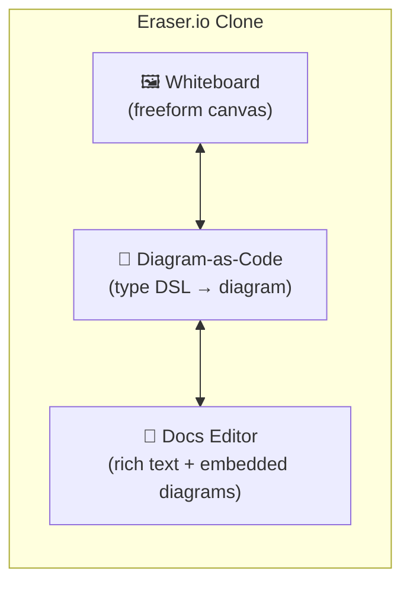
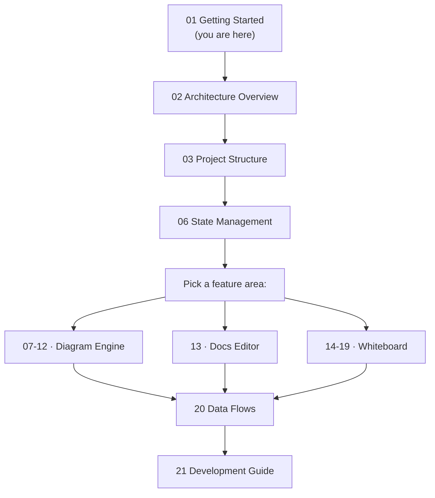

# 01 · Getting Started

> **What this document covers**: how to install, run, and explore the Eraser.io Clone project.
> Perfect for a first-time contributor.

---

## 1. Prerequisites

Before you start, make sure you have:

| Tool | Version | Why you need it |
|---|---|---|
| **Node.js** | 20.x or newer | Runs the Next.js dev server & build tools |
| **npm** | 9.x or newer | Installs dependencies (comes with Node) |
| **Git** | any | Clone the repository & manage changes |
| **VS Code** (optional) | any | Best-in-class editor experience |

Check your versions:

```bash
node --version   # e.g. v20.11.0
npm --version    # e.g. 10.2.4
```

---

## 2. Install & Run

```bash
# 1. Clone the repository (if you haven't already)
git clone <repository-url>
cd eraserio-clone

# 2. Install all dependencies
npm install

# 3. Start the development server
npm run dev
```

Open **http://localhost:3000** in your browser. The home page (`/`) automatically
redirects to **/whiteboard** where the canvas lives.

> ⚠️ **First-run note**: the diagram engine runs in a **Web Worker**. When you edit any file
> imported by `src/workers/pipeline.worker.ts` (that's `lexer.ts`, `parser.ts`, `dagre-adapter.ts`,
> `sequence-layout.ts`, and friends), Next.js does **not** hot-reload the worker bundle. You must
> **restart `npm run dev`** (or hard-refresh with `Ctrl+Shift+R`) to see your changes. See
> [08-worker-pipeline.md](08-worker-pipeline.md).

---

## 3. Available Commands

| Command | What it does |
|---|---|
| `npm run dev` | Start the dev server with hot reload |
| `npm run build` | Create an optimized production build |
| `npm start` | Serve the production build |
| `npm run lint` | Run ESLint over the whole codebase |
| `npm test` | Run the unit-test suite once (see [section 8](#8-running-the-tests)) |
| `npm run test:watch` | Run Vitest in watch mode — re-runs on every save |
| `npx tsc --noEmit` | Type-check the whole project (not a script, but the standard check) |

Use `npm test`, `npx tsc --noEmit`, and `npm run lint` before pushing changes.

---

## 4. What You Can Do in the App

This app is a clone of **Eraser.io** and combines three tools in one UI shell:



| Feature | How to try it |
|---|---|
| **Whiteboard** | Open `/whiteboard`. Pick a shape from the left toolbar and drag on the canvas. |
| **Diagram-as-Code** | Click the "Diagram-as-Code" tab in the left nav. Type `flowchart` DSL in the left panel and watch the diagram render on the right. |
| **Docs editor** | Click the "Markdown Docs" tab. Type `/` to open the slash-command menu. |

---

## 5. Keyboard Shortcuts (Whiteboard)

These are handy while developing the canvas:

| Shortcut | Action |
|---|---|
| `V` / `R` / `O` / `A` / `L` / `P` / `T` / `F` / `C` | Select / Rectangle / Circle / Arrow / Line / Pencil / Text / Frame / Comment |
| `Ctrl+Z` / `Ctrl+Y` | Undo / Redo |
| `Ctrl+C` / `Ctrl+V` / `Ctrl+D` | Copy / Paste / Duplicate |
| `Ctrl+G` / `Ctrl+Shift+G` | Group / Ungroup |
| `Delete` / `Backspace` | Delete selection |
| `Space + drag` | Pan the canvas |
| `Ctrl + scroll` | Zoom in/out |
| `Tab` | Spawn a connected node from the selected shape |
| `Ctrl+K` | Command palette |

---

## 6. Recommended Reading Order



---

## 7. Common First Questions

- **"Where does the diagram rendering happen?"** → `src/components/editor/FlowchartCanvas.tsx` and `SequenceDiagramCanvas.tsx` (see [11-diagram-rendering.md](11-diagram-rendering.md)).
- **"Where is the whiteboard state?"** → `src/lib/store/whiteboard-store.ts` (see [14-whiteboard-core.md](14-whiteboard-core.md)).
- **"How does the DSL become a diagram?"** → the Web Worker pipeline, see [07-dsl-engine.md](07-dsl-engine.md) and [08-worker-pipeline.md](08-worker-pipeline.md).
- **"Where is the app layout?"** → `src/components/workspace/EraserWorkspace.tsx` (see [05-app-shell-navigation.md](05-app-shell-navigation.md)).

---

## 8. Running the Tests

> **What this covers**: how to run the unit-test suite and how to add tests for new code.
> The project uses [Vitest](https://vitest.dev).

### 8.1 Commands

| Command | What it does |
|---|---|
| `npm test` | Run the whole suite once (CI-friendly, exits when done) |
| `npm run test:watch` | Watch mode — re-runs affected tests on every file save |
| `npx vitest run tests/<file>.test.ts` | Run a single test file while developing |

### 8.2 Where the tests live

All tests live in the root **`tests/`** folder, mirroring the `src/` structure:

```
tests/
├── dsl/      # lexer, parser, AST, validator, error-messages, run-pipeline-sync
├── layout/   # dagre-adapter, sequence-layout, text-measure, wrap-text
├── store/    # whiteboard-store (undo/redo, element CRUD, persistence)
└── render/   # orthogonal-routing, edge-geometry
```

Everything is wired up in `vitest.config.ts`:

- **Node environment** — tests run without a DOM, which is exactly right for the pure-TS core.
- **Include pattern** — only files matching `tests/**/*.test.ts` are collected.
- **`@/` alias** — maps to `src/`, so tests import real code the same way the app does
  (e.g. `import { validate } from '@/lib/dsl/validator'`).

### 8.3 Adding a new test suite

1. Create a file at `tests/<area>/<module>.test.ts` — mirror the folder you're testing, so
   `tests/layout/wrap-text.test.ts` tests `src/lib/layout/wrap-text.ts`.
2. Import Vitest explicitly (no global `describe`/`it`/`expect`):

   ```ts
   import { describe, expect, it } from 'vitest';
   import { wrapLabel } from '@/lib/layout/wrap-text';
   ```

3. Run just your file while iterating:

   ```bash
   npx vitest run tests/layout/wrap-text.test.ts
   ```

4. Before pushing, run the full gate:

   ```bash
   npm test && npx tsc --noEmit && npm run lint
   ```

### 8.4 Conventions & gotchas (learned from the existing suites)

- **Fixtures via factories** — build minimal valid elements with a factory function and override
  only what a test needs (see `rect()` in `tests/store/whiteboard-store.test.ts`).
- **No DOM in tests** — the node environment has no `OffscreenCanvas`, so `measureTextWidth`
  falls back to its char-width heuristic. Tests either pin that math or stub the global (see
  `tests/layout/text-measure.test.ts`).
- **Module singletons** — the whiteboard store and the text-measure cache keep module-level
  state. Reset a Zustand store between tests with `useWhiteboardStore.setState({ ...defaults })`
  (a merge preserves the actions); use `vi.resetModules()` + a dynamic `import()` when you need
  a fresh module instance.
- **Persistence tests** — stub `window`/`localStorage` with `vi.stubGlobal(...)` and control the
  300ms debounce with `vi.useFakeTimers()` (see the store suite).
- **Typechecking includes tests** — tsconfig's `**/*.ts` covers `tests/`, so `npx tsc --noEmit`
  validates test files too. Keep them strict-compatible (no `any`, no unchecked `!`).
