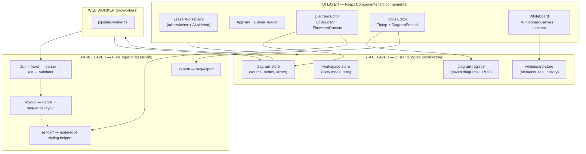
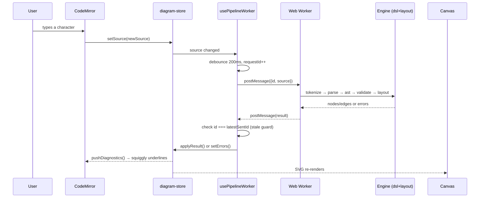

# 02 · Architecture Overview

> **What this document covers**: the big-picture system design — how the UI, state, engine, and
> Web Worker fit together, plus the tech stack and module boundaries.

---

## 1. The Big Picture

The app is a **three-in-one** Eraser.io clone:

1. **Diagram-as-Code** — you write a small DSL (e.g. `flowchart` or `sequence-diagram`) in a
   code editor, and the app renders it as an SVG diagram.
2. **Markdown Docs** — a rich-text (Tiptap) document editor where you can *embed* saved diagrams.
3. **Freeform Whiteboard** — an infinite SVG canvas with shapes, arrows, text, icons, and comments.

All three share the **same UI shell** (`EraserWorkspace`), the same **Zustand stores**, and the same
**pure-TypeScript engine** for diagram parsing & layout.

**The golden rule**: the *engine layer* (`src/lib/dsl/` and `src/lib/layout/`) is **pure TypeScript** —
zero imports of React, DOM, or `next/*`. That's what lets it run inside a Web Worker, on the main
thread, and (in the future) in Node.js.

---

## 2. Tech Stack

| Technology | Purpose | Where it's used |
|---|---|---|
| **Next.js 16** (App Router) | File-based routing, SSR, React Compiler | `src/app/` |
| **React 19** | UI components & hooks | everywhere |
| **TailwindCSS v4** | Utility-first styling, CSS variables for theming | all components |
| **shadcn/ui** | Accessible primitives: Button, Dialog, DropdownMenu, etc. | `src/components/ui/` |
| **Zustand v5** | Lightweight global state | `src/lib/store/` |
| **Chevrotain** | Tokenizer + parser for the diagram DSL | `src/lib/dsl/lexer.ts`, `parser.ts` |
| **Dagre** | Automatic graph layout for flowcharts | `src/lib/layout/dagre-adapter.ts` |
| **CodeMirror 6** | Code editor with syntax highlighting + lint | `src/components/editor/CodeEditor.tsx` |
| **Tiptap (ProseMirror)** | Rich-text document editor | `src/components/docs/` |
| **React Query** | Caches the icon-search queries | `src/lib/hooks/useIconSearch.ts` |
| **html-to-image / jspdf** | PNG/PDF export on the whiteboard | `ExportMenu.tsx` |

---

## 3. Module Boundaries (the rules that keep this clean)

### 3.1 Engine Core (`src/lib/dsl/`, `src/lib/layout/`) — "pure"

- **Zero** React, DOM, or browser dependencies.
- Pure functions: `source string → AST → laid-out graph`.
- Runs identically in: Web Worker, main thread, Node.js.

### 3.2 Web Worker (`src/workers/pipeline.worker.ts`)

- Offloads parse + layout off the main thread so typing in the editor stays smooth.
- Created only inside `useEffect` (client-only).
- Uses an incrementing `requestId` to ignore stale responses (see [08-worker-pipeline.md](08-worker-pipeline.md)).

### 3.3 Synchronous Pipeline (`src/lib/dsl/run-pipeline-sync.ts`)

- A single-pass, main-thread version used by Tiptap's diagram embed previews.
- No worker overhead for small static diagrams.

---

## 4. The 5 Zustand Stores (one-liner summary)

| Store | File | Responsibility |
|---|---|---|
| `useWorkspaceStore` | `workspace-store.ts` | View mode (`document`/`both`/`canvas`), active tab, file name, panel toggles |
| `useDiagramStore` | `diagram-store.ts` | Active DSL source, parsed nodes/edges, errors, status, editor view ref |
| `useDiagramRegistry` | `diagram-registry.ts` | Saved diagram records (create/rename/save/delete), active diagram id |
| `useDiagramLibraryStore` | `diagram-library-store.ts` | Derived selector over the registry (a list of saved diagrams) |
| `useWhiteboardStore` | `whiteboard-store.ts` | All whiteboard elements, active tool/color, undo/redo history |

> `useDiagramLibraryStore` is **not** a separate state container — it *derives* from
> `useDiagramRegistry`. Full details in [06-state-management.md](06-state-management.md).

---

## 5. What Happens When You Type in the Diagram Editor?

This flow is the heart of the app — see [08-worker-pipeline.md](08-worker-pipeline.md) for a deep dive.

---

## 6. Where Things Render

- **Flowcharts** → `src/components/editor/FlowchartCanvas.tsx` (SVG `<g>` per node/edge).
- **Sequence diagrams** → `src/components/editor/SequenceDiagramCanvas.tsx`.
- **Whiteboard** → `src/components/whiteboard/WhiteboardCanvas.tsx` (one big `<svg>` with a
  `<g transform="translate(...) scale(...)">` for pan/zoom).
- **Docs embeds** → `src/components/docs/DiagramPreview.tsx` (read-only SVG from the sync pipeline).

---

## 7. Suggested Mental Model

> Think of it as **three apps sharing one engine**:
> - The **DSL engine** turns text into geometry (pure functions, worker-friendly).
> - The **stores** are the single source of truth that every component reads from.
> - The **UI layer** is a thin, pretty window over the stores + engine.
>
> If you ever ask *"where should this logic live?"* — geometry/parsing goes in `src/lib`,
> UI state goes in a store, and pixel-perfect presentation goes in `src/components`.
