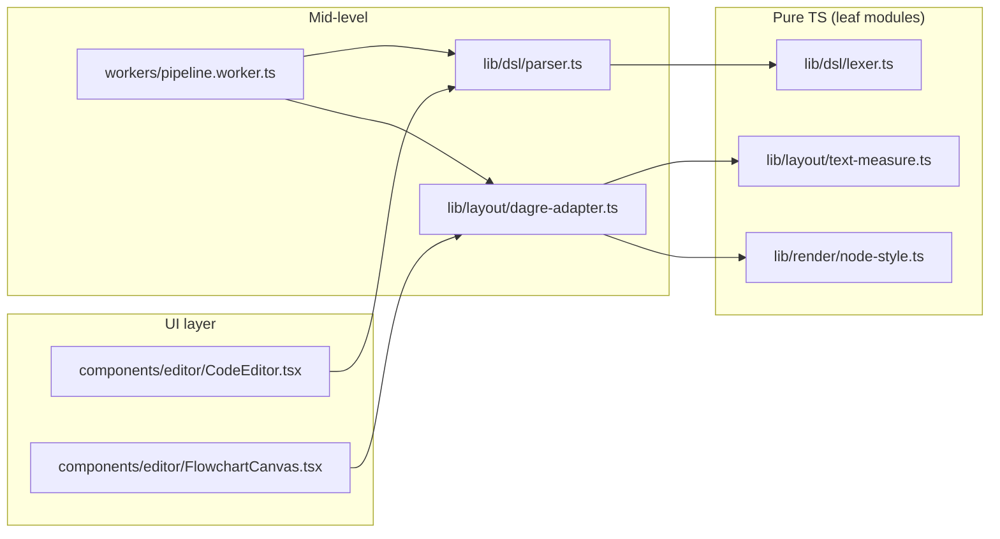

# 03 · Project Structure

> **What this document covers**: the complete `src/` folder tree, explained folder-by-folder,
> so you always know where to look.

---

## 1. Top-Level Layout

```
eraserio-clone/
├── .agents/                  # Agent context files (architecture, dataflows, dev-rules, status)
├── .gitignore
├── AGENTS.md                 # Instructions for AI agents working in this repo
├── Documentation/            # 👈 YOU ARE HERE — developer docs
├── components.json           # shadcn/ui config
├── eslint.config.mjs         # ESLint flat config
├── next.config.ts            # Next.js config
├── package.json              # Dependencies & scripts
├── postcss.config.mjs        # TailwindCSS v4 PostCSS config
├── public/                   # Static assets (fonts, cursors, icons)
├── tsconfig.json             # TypeScript config
└── src/                      # 👈 ALL application code lives here
```

---

## 2. The `src/` Tree (Annotated)

```mermaid
flowchart TD
    SRC["src/"]
    SRC --> APP["app/ — Next.js pages"]
    SRC --> COMP["components/ — React UI"]
    SRC --> LIB["lib/ — logic, stores, engine"]
    SRC --> WORKERS["workers/ — Web Worker"]

    APP --> LAYOUT["layout.tsx<br/>root layout"]
    APP --> PAGE["page.tsx<br/>redirects to /whiteboard"]
    APP --> WB["whiteboard/page.tsx"]
    APP --> SET["settings/page.tsx"]

    COMP --> UI["ui/ — shadcn primitives"]
    COMP --> WORKSPACE["workspace/EraserWorkspace.tsx"]
    COMP --> CANVAS["canvas/ — toolbar + insert popup"]
    COMP --> EDITOR["editor/ — code editor + SVG canvases"]
    COMP --> DOCS["docs/ — Tiptap editor components"]
    COMP --> WBC["whiteboard/ — canvas, overlays, toolbars"]

    LIB --> DSL["dsl/ — lexer, parser, ast, validator"]
    LIB --> LAYOUT2["layout/ — dagre + sequence layout"]
    LIB --> RENDER["render/ — node/edge style helpers"]
    LIB --> EXPORT["export/ — svg-export.ts"]
    LIB --> STORE["store/ — 5 Zustand stores"]
    LIB --> HOOKS["hooks/ — usePanZoom, usePipelineWorker, ..."]
    LIB --> ICONS["icons/ — icon-catalog.ts"]
    LIB --> WB2["whiteboard/ — types, routing, tools"]

    WORKERS --> PW["pipeline.worker.ts"]
```



### 2.1 `src/app/` — Next.js App Router Pages

| File | Purpose |
|---|---|
| `layout.tsx` | Root layout: fonts, `ThemeProvider`, `QueryProvider`, `AppNav` |
| `page.tsx` | Home page — simply `redirect('/whiteboard')` |
| `whiteboard/page.tsx` | The canvas page: sets view mode to `canvas`, hydrates whiteboard, renders header + workspace |
| `settings/page.tsx` | Settings page: theme switch + keyboard shortcuts reference |
| `globals.css` | Tailwind import + global styles |

### 2.2 `src/components/` — React UI

| Folder | Purpose |
|---|---|
| `ui/` | shadcn/ui primitives (`button`, `dialog`, `dropdown-menu`, ...) |
| `workspace/` | `EraserWorkspace.tsx` — the shared tabbed shell + AI sidebar |
| `canvas/` | `CanvasVerticalToolbar.tsx` (left tool palette) + `InsertItemPopup.tsx` (insert catalog) |
| `editor/` | Diagram-as-Code: `CodeEditor.tsx`, `FlowchartCanvas.tsx`, `SequenceDiagramCanvas.tsx`, `NodeIcon.tsx`, `DiagramEditorView.tsx` |
| `docs/` | Tiptap: `diagram-embed-extension.ts`, `DiagramEmbedView.tsx`, `DiagramPickerDialog.tsx`, `DiagramPreview.tsx`, `DocBottomToolbar.tsx`, `slash-command-extension.ts`, `SlashMenuList.tsx` |
| `whiteboard/` | The freeform canvas: `WhiteboardCanvas.tsx`, `WhiteboardElements.tsx`, `WhiteboardOverlays.tsx`, `CommentThread.tsx`, `ContextMenu.tsx`, `CommandPalette.tsx`, `ExportMenu.tsx`, `InlineTextEditor.tsx`, `ZoomPanMenu.tsx`, `ThemeToggle.tsx`, `CloudIconPicker.tsx`, plus `toolbars/` and `ui/` subfolders |
| `AppNav.tsx`, `EraserHeader.tsx`, `providers/QueryProvider.tsx` | App chrome |

### 2.3 `src/lib/` — Logic, Stores, Engine (no React components, mostly pure TS)

| Folder | Purpose |
|---|---|
| `dsl/` | **Diagram DSL engine**: `lexer.ts` (Chevrotain tokens), `parser.ts` (CST), `ast.ts` (CST→AST), `validator.ts` (semantic errors), `error-messages.ts`, `run-pipeline-sync.ts`, `codemirror-language.ts`, `codemirror-lint.ts`, `diagnostics.ts` |
| `layout/` | **Auto-layout**: `dagre-adapter.ts`, `sequence-layout.ts`, `types.ts`, `sequence-types.ts`, `text-measure.ts` (OffscreenCanvas), `wrap-text.ts` |
| `render/` | **SVG helpers**: `node-style.ts` (colors/icons), `edge-geometry.ts` (edge paths), `text-style.ts` (font constants) |
| `export/` | `svg-export.ts` — SVG/PNG download |
| `store/` | The 5 Zustand stores |
| `hooks/` | `usePipelineWorker.ts`, `usePanZoom.ts`, `useWhiteboardInteractions.ts`, `useIconSearch.ts`, `useOnClickOutside.ts` |
| `icons/` | `icon-catalog.ts` — system-design icon registry (Iconify + react-icons) |
| `whiteboard/` | `whiteboard-types.ts` (element types), `orthogonal-routing.ts` (elbow paths), `tool-definitions.ts`, `code-highlighter.tsx` |
| `utils.ts` | `cn()` (tailwind-merge) + `generateId()` |

### 2.4 `src/workers/`

| File | Purpose |
|---|---|
| `pipeline.worker.ts` | Web Worker entry: receives `{id, source}`, runs lex→parse→ast→validate→layout, posts back the result |

---

## 3. Dependency Flow (what imports what)



**Key rule of thumb**: `components/*` can import from `lib/*`, but `lib/dsl` and `lib/layout` must
never import from `components/*` or `react`.

---

## 4. "I need to change X — where is it?"

| Task | Look in |
|---|---|
| Change how flowcharts render | `src/components/editor/FlowchartCanvas.tsx` |
| Add a new DSL token / syntax | `src/lib/dsl/lexer.ts` + `parser.ts` |
| Change node colors/icons | `src/lib/render/node-style.ts` |
| Change layout spacing | `src/lib/layout/dagre-adapter.ts` (or `sequence-layout.ts`) |
| Add a whiteboard tool | `src/lib/whiteboard/whiteboard-types.ts` + `tool-definitions.ts` |
| Change keyboard shortcuts | `src/lib/hooks/useWhiteboardInteractions.ts` |
| Change how elements are stored | `src/lib/store/whiteboard-store.ts` |
| Add a Tiptap command | `src/components/docs/slash-command-extension.ts` + `SlashMenuList.tsx` |
| Change pan/zoom behavior | `src/lib/hooks/usePanZoom.ts` |
