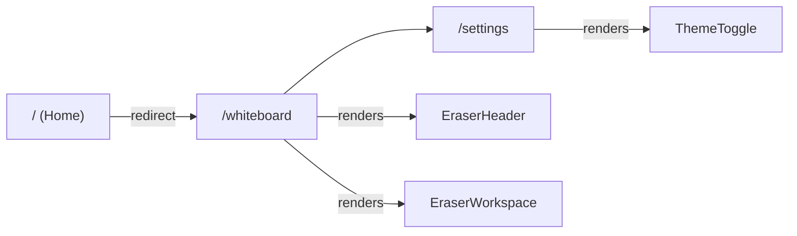
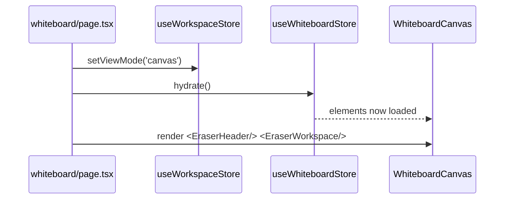

# 04 · Routing & Pages

> **What this document covers**: how Next.js App Router wires the routes together, what each page
> does, and how pages talk to the Zustand stores.

---

## 1. Route Map



| Route | File | What it shows |
|---|---|---|
| `/` | `src/app/page.tsx` | Just redirects to `/whiteboard` |
| `/whiteboard` | `src/app/whiteboard/page.tsx` | The main app: header + workspace (canvas-focused) |
| `/settings` | `src/app/settings/page.tsx` | Theme settings + keyboard shortcut reference |

---

## 2. Root Layout — `src/app/layout.tsx`

This wraps **every** page. It sets up fonts, providers, and the persistent left sidebar.

```tsx
export default function RootLayout({ children }: { children: React.ReactNode }) {
  return (
    <html lang="en" suppressHydrationWarning className="h-full antialiased font-sans">
      <body className="h-screen w-screen overflow-hidden flex flex-row bg-background text-foreground">
        <ThemeProvider attribute="class" defaultTheme="system" enableSystem disableTransitionOnChange>
          <QueryProvider>
            <AppNav />              {/* 👈 persistent left sidebar */}
            <main className="flex flex-1 flex-col h-full w-full overflow-hidden">
              {children}
            </main>
          </QueryProvider>
        </ThemeProvider>
      </body>
    </html>
  );
}
```

**Key points for beginners:**

- `<AppNav />` renders once, on every page — it's the left sidebar.
- `ThemeProvider` (from `next-themes`) gives us `useTheme()` anywhere — the whiteboard uses it to
  pick light/dark cursor art.
- `QueryProvider` mounts a React Query client used by icon search.
- `suppressHydrationWarning` is on `<html>`/`<body>` because the theme class is applied on the
  client — this avoids a hydration mismatch flash.

---

## 3. Home Page — `src/app/page.tsx`

The simplest page in the app:

```tsx
import { redirect } from 'next/navigation';

export default function Home() {
  redirect('/whiteboard');
}
```

**Why redirect instead of rendering the app here?** The real app lives at `/whiteboard`. The home
route is just a friendly entry point. `redirect()` from `next/navigation` is a server-side redirect.

---

## 4. Whiteboard Page — `src/app/whiteboard/page.tsx`

This is a **client component** (`'use client'`) that assembles the main experience:

```tsx
export default function WhiteboardPage() {
  const setViewMode = useWorkspaceStore((s) => s.setViewMode);
  const hydrate = useWhiteboardStore((s) => s.hydrate);

  useEffect(() => {
    setViewMode('canvas');        // 👈 force the "Canvas" view mode
  }, [setViewMode]);

  useEffect(() => {
    hydrate();                    // 👈 load saved elements from localStorage
  }, [hydrate]);

  return (
    <div className="flex h-screen w-full flex-col overflow-hidden bg-background">
      <EraserHeader />
      <EraserWorkspace />
    </div>
  );
}
```

**What's happening:**

1. `setViewMode('canvas')` — tells the workspace store to show the canvas-only layout.
2. `hydrate()` — reads the last-session whiteboard elements from `localStorage` (key
   `'eraser-whiteboard-elements'`) into the whiteboard store. This runs **after mount** to avoid
   SSR/hydration mismatches.
3. Renders the header + workspace shell.

---

## 5. Settings Page — `src/app/settings/page.tsx`

A mostly-static page that shows:

- A **Theme** section using `ThemeToggle` (see [19-whiteboard-toolbars.md](19-whiteboard-toolbars.md))
- A **Keyboard Shortcuts** reference, built from a `SHORTCUT_GROUPS` array.

```tsx
const SHORTCUT_GROUPS = [
  {
    title: 'Drawing Tools',
    icon: MousePointer,
    shortcuts: [
      { keys: 'V', label: 'Select Tool' },
      { keys: 'R', label: 'Rectangle' },
      // ... more
    ],
  },
  // Actions, Navigation & View groups...
];
```

> 💡 **Beginner tip**: if you add a new keyboard shortcut in
> `useWhiteboardInteractions.ts`, add it to this page too so users can discover it.

---

## 6. How Pages Connect to State

Pages never hold state themselves (except local UI state). They read/write **Zustand stores**:



The stores are the *single source of truth* — components subscribe with selectors like
`useWorkspaceStore((s) => s.viewMode)` and re-render only when that slice changes.

---

## 7. Adding a New Page

1. Create a folder + `page.tsx` under `src/app/` (e.g. `src/app/about/page.tsx`).
2. If it's interactive, add `'use client'` at the top.
3. The root layout (sidebar + providers) automatically wraps it.
4. To navigate to it, use Next's `<Link>` (see `EraserHeader.tsx` for an example) — **never**
   `window.location.href`, which would lose all Zustand state.

> ⚠️ **Navigation rule** (from the dev guide): always use `next/link`'s `<Link>` or
> `useRouter().push()` for client-side routing. Raw `<a href>` / `window.location` reloads the page
> and resets every store.
