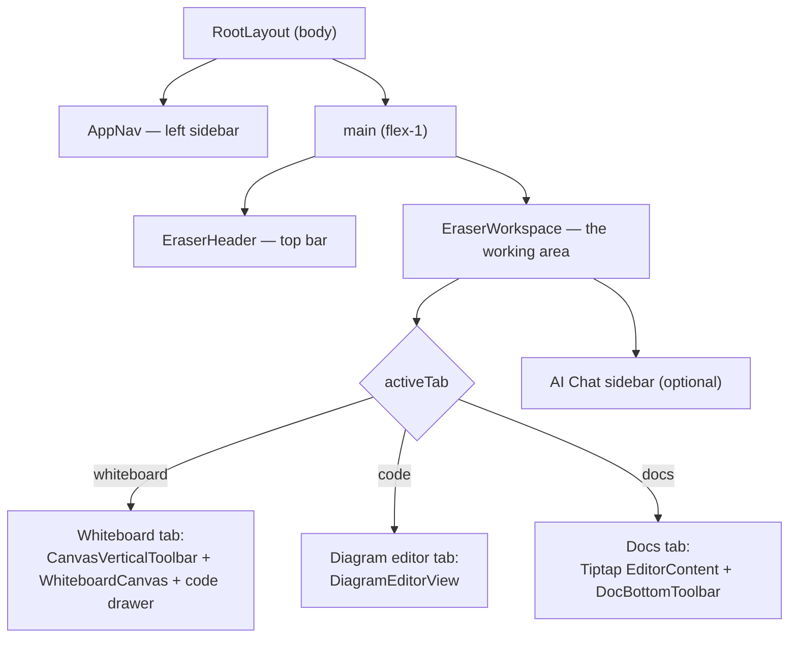

# 05 · App Shell & Navigation

> **What this document covers**: the three components that form the app's chrome —
> `AppNav`, `EraserHeader`, and `EraserWorkspace` — plus how the view-mode/tab system works.

---

## 1. The Layout Hierarchy



---

## 2. `AppNav` — the Collapsible Left Sidebar

**File**: `src/components/AppNav.tsx`

This is a thin, static sidebar that:

- Shows the brand mark ("E" logo) and a collapse toggle.
- Lists three navigation items: **Whiteboard**, **Diagram-as-Code**, **Markdown Docs**.
- Shows two placeholder quick actions (**New File**, **Documents**) and a **Settings** footer button.

The important detail: it drives `activeTab` in the workspace store, **not** the URL.

```tsx
const NAV_ITEMS = [
  { tab: 'whiteboard', label: 'Whiteboard', icon: LayoutGrid },
  { tab: 'code', label: 'Diagram-as-Code', icon: Code2 },
  { tab: 'docs', label: 'Markdown Docs', icon: FileText },
];

// inside the component:
const activeTab = useWorkspaceStore((s) => s.activeTab);
const setActiveTab = useWorkspaceStore((s) => s.setActiveTab);

<button onClick={() => setActiveTab(item.tab)} className={isActive ? 'bg-secondary' : ''}>
  <Icon /> {!collapsed && <span>{item.label}</span>}
</button>
```

> 💡 **Beginner note**: the app keeps the *document type* (whiteboard / code / docs) in the
> `workspace-store` as `activeTab`. The *view mode* (document / both / canvas) is a separate
> concept, `viewMode`, controlled by the header. The two work together — e.g. `/whiteboard`
> forces `viewMode: 'canvas'`.

---

## 3. `EraserHeader` — the Top Bar

**File**: `src/components/EraserHeader.tsx`

It contains (left → right):

1. Brand icon + **editable file name** input (`fileName` in the workspace store).
2. The **Eraser view switcher**: `[Document | Both | Canvas]` — writes `viewMode`.
3. Actions: **Commands** (opens `CommandPalette`, Ctrl+K), **Share**, **Eraser AI** (toggles the AI
   chat sidebar), **Comment visibility** toggle, **ThemeToggle**, and a **Settings** link.

```tsx
const viewOptions = [
  { mode: 'document', label: 'Document' },
  { mode: 'both', label: 'Both' },
  { mode: 'canvas', label: 'Canvas' },
];

// Renders a segmented control:
{viewOptions.map((opt) => (
  <button key={opt.mode} onClick={() => setViewMode(opt.mode)}
    className={viewMode === opt.mode ? 'bg-background text-foreground' : 'text-muted-foreground'}>
    {opt.label}
  </button>
))}
```

It also registers the global **Ctrl/Cmd+K** handler that opens the command palette:

```tsx
useEffect(() => {
  const handleKeyDown = (e: KeyboardEvent) => {
    if ((e.ctrlKey || e.metaKey) && e.key.toLowerCase() === 'k') {
      e.preventDefault();
      setCommandPaletteOpen(true);
    }
  };
  window.addEventListener('keydown', handleKeyDown);
  return () => window.removeEventListener('keydown', handleKeyDown);
}, []);
```

---

## 4. `EraserWorkspace` — the Shared Working Area

**File**: `src/components/workspace/EraserWorkspace.tsx`

This is the busiest component. It:

1. Calls `usePipelineWorker()` (starts the Web Worker — see [08-worker-pipeline.md](08-worker-pipeline.md)).
2. Creates the Tiptap editor instance for the docs tab.
3. Renders whichever tab is active (`whiteboard` | `code` | `docs`).
4. Renders the collapsible **AI Chat** sidebar when `aiChatOpen`.

### The Tiptap editor (docs tab)

```tsx
const editor = useEditor({
  extensions: [
    StarterKit,
    Placeholder.configure({ placeholder: 'Type your notes or document here...' }),
    DiagramEmbed,          // custom node — see docs/13-docs-editor.md
    SlashCommandExtension, // "/" menu — see docs/13-docs-editor.md
  ],
  content: '<h1 class="text-2xl font-bold mb-4">Untitled File</h1><p></p>',
  immediatelyRender: false, // ⚠️ REQUIRED for SSR hydration — see dev guide
});
```

### The whiteboard tab

This is where the diagram-as-code *drawer* lives (a floating, draggable CodeMirror panel):

```tsx
{diagramCodeOpen && (
  <div className="absolute z-30 flex h-72 w-96 flex-col rounded-xl border bg-background/95 ..."
       style={{ top: `${drawerPos.y}px`, right: `${drawerPos.x}px` }}>
    <div onPointerDown={handleHeaderPointerDown} ...>  {/* drag handle */}
      <span>Diagram Code (DSL)</span>
      <Button onClick={toggleDiagramCode}><X /></Button>
    </div>
    <div className="flex-1 overflow-hidden"><CodeEditor /></div>
  </div>
)}
<div className="relative flex-1 overflow-hidden">
  <WhiteboardCanvas />
</div>
```

The drawer is draggable: `handleHeaderPointerDown/Move/Up` track the pointer and update
`drawerPos` state.

### The AI chat sidebar

```tsx
{aiChatOpen && (
  <div className="z-40 flex h-full w-80 flex-col border-l bg-background shadow-xl ...">
    {/* Header, suggestion buttons, and an input — currently a placeholder UI */}
  </div>
)}
```

---

## 5. State Used by the Shell

| Store field | Who reads it | Who writes it |
|---|---|---|
| `activeTab` | `EraserWorkspace` (which tab to render) | `AppNav` |
| `viewMode` | (reserved for document/both/canvas layouts) | `EraserHeader`, `whiteboard/page.tsx` |
| `fileName` | `EraserHeader` (input value) | `EraserHeader` |
| `aiChatOpen` | `EraserWorkspace` (render AI sidebar), `EraserHeader` (button state) | `EraserHeader`, `EraserWorkspace`, `CanvasVerticalToolbar`, `InsertItemPopup` |
| `diagramCodeOpen` | `EraserWorkspace` (render drawer) | `EraserWorkspace`, `InsertItemPopup` |
| `hideUI` | `WhiteboardCanvas` + `EraserWorkspace` (hide chrome) | `ZoomPanMenu` |

---

## 6. Summary

- **AppNav** = navigation *tabs* (which tool).
- **EraserHeader** = title, *view mode*, and global actions.
- **EraserWorkspace** = the tabbed body + floating panels.
- All of them communicate **only through the workspace store** — no prop drilling, no callbacks
  threading through the tree.
