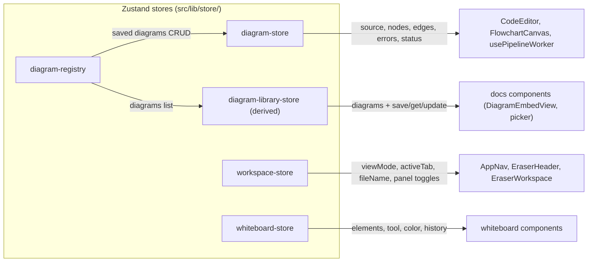

# 06 · State Management (Zustand Stores)

> **What this document covers**: all five Zustand stores — what state they hold, what actions they
> expose, and how components consume them.

---

## 1. What is Zustand?

Zustand is a tiny state library. You create a store with `create()` and read slices with
selectors:

```ts
const useStore = create((set) => ({
  count: 0,
  increment: () => set((s) => ({ count: s.count + 1 })),
}));

// In a component:
const count = useStore((s) => s.count);     // subscribes to `count` only
const increment = useStore((s) => s.increment);
```

Components re-render **only when the selected slice changes**. That's the pattern used all over
this app — you'll see `useWhiteboardStore((s) => s.activeTool)` everywhere.

---

## 2. Store Map



---

## 3. `useWorkspaceStore` — UI Shell State

**File**: `src/lib/store/workspace-store.ts`

| Field | Type | Meaning |
|---|---|---|
| `viewMode` | `'document' \| 'both' \| 'canvas'` | Which layout mode the workspace shows |
| `activeTab` | `'whiteboard' \| 'code' \| 'docs'` | Which tool tab is active |
| `fileName` | `string` | Editable document name (header input) |
| `aiChatOpen` | `boolean` | AI chat sidebar open? |
| `diagramCodeOpen` | `boolean` | Floating DSL code drawer open? |
| `insertItemOpen` | `boolean` | Insert-item catalog popup open? |
| `insertItemCategory` | `'main' \| 'shapes' \| 'icons' \| 'frames'` | Which sub-category of the insert popup is shown |

It also exposes `setX` / `toggleX` actions for each field. Note `toggleInsertItem` resets the
category to `'main'` on **every** toggle (both open *and* close).

---

## 4. `useDiagramStore` — Active Diagram State

**File**: `src/lib/store/diagram-store.ts`

This is the store the DSL pipeline writes into. Key fields:

| Field | Meaning |
|---|---|
| `source` | The DSL source text the user is editing |
| `currentDiagramId` | Which saved diagram (in the registry) we're editing |
| `diagramKind` | `'flowchart' \| 'sequence' \| null` — detected from the source |
| `nodes` / `rawNodes` | Laid-out flowchart nodes; `rawNodes` is the layout output, `nodes` includes manual drag overrides |
| `edges` | Laid-out flowchart edges |
| `nodeOverrides` | `{ [nodeId]: {x, y} }` — manual positions from dragging |
| `sequenceActors/Messages/Width/Height` | Sequence-diagram layout output |
| `errors` | `PipelineError[]` (blocking errors or warnings) |
| `status` | `'idle' \| 'pending' \| 'ok' \| 'error'` — pipeline lifecycle |
| `editorView` | Reference to the CodeMirror `EditorView` (for pushing diagnostics) |
| `svgElement` | Reference to the currently mounted SVG canvas (for export) |

**Key actions:**

- `setSource(source)` — user typed; triggers the worker pipeline.
- `loadDiagram(id, source)` — switch to another saved diagram; **resets** everything specific to
  the previous one (overrides, errors, nodes) so state doesn't bleed across diagrams.
- `applyResult(result, diagnostics)` — called by the worker hook on success. Merges
  `nodeOverrides` into the laid-out nodes and updates status to `'ok'`.
- `setErrors(errors)` / `setPending()` — pipeline failure / in-flight.
- `setNodePosition(id, x, y)` / `resetNodePosition(id)` — manual drag & double-click reset.

> 💡 `applyResult` re-applies overrides: it maps `result.nodes` and replaces the x/y of any node
> that has an override. That's how dragged nodes keep their position on every keystroke.

---

## 5. `useDiagramRegistry` — Saved Diagrams CRUD

**File**: `src/lib/store/diagram-registry.ts`

Think of this as the "diagram library" — saved diagrams you can embed in docs.

```ts
export interface DiagramRecord {
  id: string;
  name: string;
  source: string;
}
```

| Action | Behavior |
|---|---|
| `initialize()` | Seeds one default diagram ("Untitled diagram") on first run; no-op if already initialized |
| `createDiagram(name, source)` | Adds a record, sets it active, returns its id |
| `renameDiagram(id, name)` | Renames |
| `updateSource(id, source)` | Saves the latest source (called as you type!) |
| `deleteDiagram(id)` | Removes; moves `activeDiagramId` to the first remaining |
| `setActiveDiagram(id)` | Marks active |
| `saveDiagram(name, source)` | Renames + updates the active diagram, or creates a new one |
| `getDiagram(id)` | Lookup |

`useActiveDiagram()` is a convenience selector returning the full active record:

```ts
export function useActiveDiagram(): DiagramRecord | null {
  return useDiagramRegistry((state) =>
    state.activeDiagramId ? state.diagrams[state.activeDiagramId] ?? null : null
  );
}
```

> ⚠️ **Hot-sync note**: `usePipelineWorker` calls `updateSource(currentDiagramId, source)` on every
> keystroke so doc embeds referencing a diagram always show the *current* content.

---

## 6. `useDiagramLibraryStore` — Derived Library View

**File**: `src/lib/store/diagram-library-store.ts`

Not a real store — it's a **custom hook + selector API** that derives a stable
`{ diagrams, saveDiagram, getDiagram, updateDiagramSource }` shape from the registry, so the docs
components don't need to know about the registry's internal `order`/`diagrams` split.

```ts
export function useDiagramLibraryStore<T>(selector: (state: DiagramLibraryState) => T): T {
  const order = useDiagramRegistry((s) => s.order);
  const diagramsMap = useDiagramRegistry((s) => s.diagrams);
  // ... memoizes the list & actions, returns selector(libraryState)
}
```

It also exposes a static `useDiagramLibraryStore.getState()` for use outside React (rare).

---

## 7. `useWhiteboardStore` — the Whiteboard Brain

**File**: `src/lib/store/whiteboard-store.ts` (large — see [14-whiteboard-core.md](14-whiteboard-core.md) for a deep dive)

A quick summary of what it holds:

- **Active style**: `activeTool`, `activeColor`, `activeStrokeHex/FillHex`, `activeStrokeWidth`,
  `activeLineStyle`, arrowhead styles, routing style, corner radius, fill style, animated flag.
- **Document**: `elements[]`, `selectedIds[]`, `history[]`/`future[]` (undo/redo), `clipboard[]`.
- **View**: `showGrid`, `hideUI`, `showComments`.
- **Actions**: add/update/delete/move/resize elements, layering, alignment, group/ungroup,
  duplicate/copy/paste, comment ops, `undo`/`redo`, `spawnConnectedNode`, `reconnectArrowEndpoint`,
  `hydrate` (load from localStorage).

---

## 8. Reading Stores Correctly (common pattern)

Always subscribe with a **selector** — never grab the whole store unless you must:

```tsx
// ✅ Good — only re-renders when activeTool changes
const activeTool = useWhiteboardStore((s) => s.activeTool);

// ✅ Good — calling an action doesn't cause re-render of this component
const addElement = useWhiteboardStore((s) => s.addElement);

// ⚠️ Avoid — re-renders on every store change
// const { activeTool, addElement } = useWhiteboardStore();
```

To read current state *outside* a render (e.g. in an event handler), use
`useWhiteboardStore.getState()`:

```tsx
const state = useWhiteboardStore.getState(); // no subscription
state.setActiveTool('rectangle');
```
