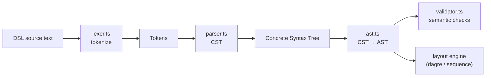

# 07 · Diagram DSL Engine

> **What this document covers**: the "Diagram-as-Code" core — how DSL text is turned into an
> Abstract Syntax Tree (AST) using Chevrotain. Files: `lexer.ts`, `parser.ts`, `ast.ts`,
> `validator.ts`, `error-messages.ts`.

---

## 1. The Pipeline in One Picture



Each stage is a **pure function** — no React, no DOM — so it runs in the Web Worker too
(see [08-worker-pipeline.md](08-worker-pipeline.md)).

---

## 2. The DSL Syntax (what users write)

```text
flowchart

Client [icon: user]
API Gateway
Auth Service [icon: database]

Client > API Gateway: request
API Gateway > Auth Service: validate token
```

And a sequence diagram:

```text
sequence-diagram

Client
Server
Database

Client --> Server: login request
Server --> Database: check session
```

| Piece | Example | Meaning |
|---|---|---|
| First line | `flowchart` / `sequence-diagram` | Diagram type |
| Node declaration | `Client [icon: user]` | A node with attributes in `[...]` |
| Node with explicit id | `API Gateway: Gateway` | id: label |
| Edge (sync) | `Client > API Gateway: request` | `>` arrow with label |
| Edge (async) | `Server --> Database` | `-->` arrow |

---

## 3. `lexer.ts` — Turning Text into Tokens

**File**: `src/lib/dsl/lexer.ts`

Chevrotain lets you define tokens with regex patterns, then build a `Lexer` from them.

```ts
export const NewLine = createToken({ name: 'NewLine', pattern: /\r?\n/ });
export const Comment = createToken({ name: 'Comment', pattern: /\/\/[^\n]*/, group: Lexer.SKIPPED });
export const DashArrow = createToken({ name: 'DashArrow', pattern: /-->/ });
export const Arrow = createToken({ name: 'Arrow', pattern: />/ });
export const FreeText = createToken({
  name: 'FreeText',
  pattern: /(?:(?!-->)[^[\]:>,\r\n])+/,
});
```

**Beginner notes:**

- `Lexer.SKIPPED` means comments are ignored during tokenization.
- **Order matters** in `allTokens`: `DashArrow` (`-->`) is listed **before** `Arrow` (`>`), and the
  `FreeText` regex uses a **negative lookahead** `(?!-->)` so it never swallows the start of
  `-->`. This is the classic "longest-match-wins by listing order" pitfall — read the comments!
- `tokenize(source)` returns `{ tokens, errors }` — errors carry `line`/`column` for the editor.

---

## 4. `parser.ts` — Building the CST

**File**: `src/lib/dsl/parser.ts`

A Chevrotain `CstParser` declares the grammar as **rules**:

```ts
public program = this.RULE('program', () => {
  this.MANY(() => this.CONSUME(NewLine));
  this.SUBRULE(this.diagramTypeLine);
  this.MANY2(() => {
    this.MANY3(() => this.CONSUME2(NewLine));
    this.OR([
      { GATE: () => this.lineHasArrow(), ALT: () => this.SUBRULE(this.edgeDecl) },
      { ALT: () => this.SUBRULE(this.nodeDecl) },
    ]);
  });
  this.MANY4(() => this.CONSUME3(NewLine));
});
```

**How it decides node vs edge**: it scans forward up to 50 tokens looking for an `Arrow` or
`DashArrow` before the next `NewLine` (`lineHasArrow()`). If found → edge declaration, otherwise →
node declaration.

`parse(tokens)` returns `{ cst, errors }`. The parser is a **singleton** (`parserInstance`) —
Chevrotain requires reusing one instance with `input` set each time.

---

## 5. `ast.ts` — CST → AST

**File**: `src/lib/dsl/ast.ts`

The AST is a simpler, friendlier tree:

```ts
export interface NodeDecl {
  id: string; label: string;
  attrs: Record<string, string>; // e.g. { icon: 'user', color: 'blue' }
  line?: number;
}

export interface EdgeDecl {
  from: string; to: string;
  label?: string;
  arrowType: 'sync' | 'async';
  line?: number;
}

export interface DiagramAST {
  type: 'flowchart' | 'sequence-diagram' | 'unknown';
  nodes: NodeDecl[];
  edges: EdgeDecl[];
}
```

The `AstBuilder` class uses Chevrotain's generated visitor base
(`parserInstance.getBaseCstVisitorConstructorWithDefaults()`) and walks the CST:

- `nodeDecl` → registers a `NodeDecl`; if the node already exists, it **merges** label/attrs
  (this is how you can declare a node implicitly by referencing it in an edge).
- `edgeDecl` → `ensureNode` creates implicit nodes for endpoints, then pushes an `EdgeDecl`.
- `attrList`/`attrPair` → `{ key: value }` object for `[...]` attributes.

---

## 6. `validator.ts` — Semantic Checks

**File**: `src/lib/dsl/validator.ts`

The validator produces **non-blocking warnings** and **blocking errors**:

| Check | Severity | Example message |
|---|---|---|
| Unknown diagram type | `error` | `Unknown diagram type. First line must be 'flowchart' or 'sequence-diagram'.` |
| Empty node name | `error` | `Node has an empty name.` |
| Duplicate node id | `error` | `Duplicate node "X".` |
| Unknown icon name | `warning` | `Unknown icon "foo". Supported: user, database, ...` |
| Edge references unknown node | `error` | `Edge references unknown node "Z".` |

```ts
export function validate(ast: DiagramAST): ValidationError[] {
  const errors: ValidationError[] = [];
  if (ast.type === 'unknown') { errors.push({ ...severity: 'error' }); }
  // ...duplicate/empty/icon checks...
  // ...edge endpoint checks...
  return errors;
}
```

Warnings don't stop rendering — a diagram with a typo'd icon still renders, just without the icon.

---

## 7. `error-messages.ts` — Human-Friendly Parse Errors

**File**: `src/lib/dsl/error-messages.ts`

Chevrotain's raw exceptions reference internal token names like `Colon` or `FreeText`. This module
maps them to what a user would recognize:

```ts
const TOKEN_LABELS: Record<string, string> = {
  Colon: "':'", Arrow: "'>'", DashArrow: "'-->'",
  LBracket: "'['", RBracket: "']'", Comma: "','",
  NewLine: 'end of line', FreeText: 'text', EOF: 'end of the diagram',
};

export function humanizeParseError(err: IRecognitionException) {
  switch (err.name) {
    case 'MismatchedTokenException':
      return { message: `Unexpected ${labelFor(found)} here — check the syntax on this line.`, line };
    case 'NoViableAltException':
      return { message: `This line doesn't match a valid node, actor, edge, or message declaration.`, line };
    // ...
  }
}
```

---

## 8. Where Each Stage Runs

| Stage | Runs in Worker? | Runs sync (docs preview)? |
|---|---|---|
| `lexer.ts` | ✅ | ✅ |
| `parser.ts` | ✅ | ✅ |
| `ast.ts` | ✅ | ✅ |
| `validator.ts` | ✅ | ✅ |
| `dagre/sequence layout` | ✅ | ✅ |

The worker orchestrates all of it (see [08-worker-pipeline.md](08-worker-pipeline.md)); the
synchronous path used by docs embeds is `run-pipeline-sync.ts`.

---

## 9. Checklist for Adding a New DSL Feature

1. Add/reuse tokens in `lexer.ts` (mind token order & lookaheads!).
2. Extend the grammar rules in `parser.ts` (and `lineHasArrow` if you add new line kinds).
3. Add AST types + visitor logic in `ast.ts`.
4. Add validation in `validator.ts`.
5. Update `error-messages.ts` labels if you introduced new tokens.
6. Update the CodeMirror highlighter in `codemirror-language.ts` (see [09-code-editor.md](09-code-editor.md)).
7. **Restart `npm run dev`** — the worker bundle doesn't hot-reload!
