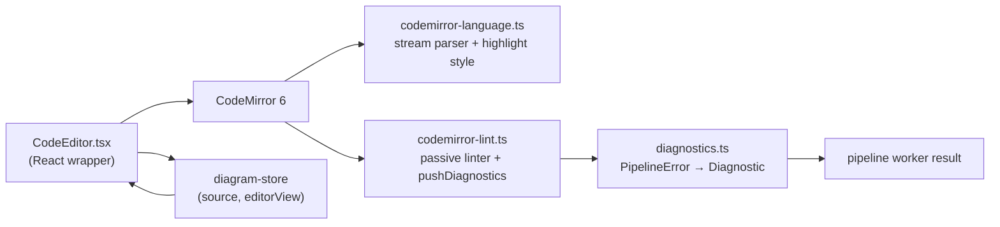
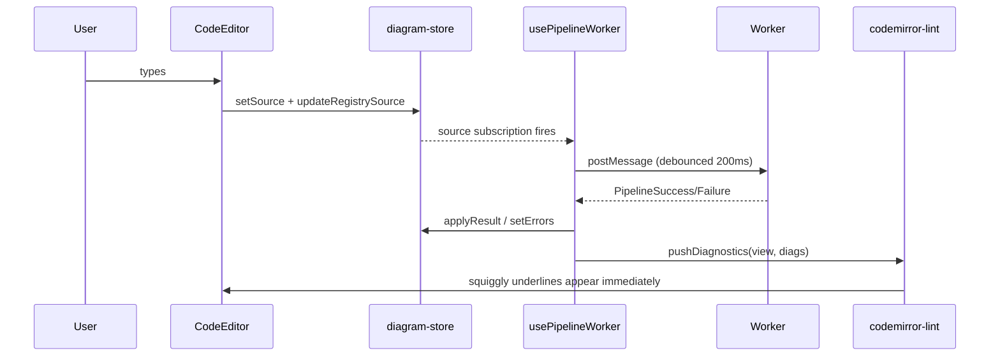

# 09 · Code Editor (CodeMirror 6)

> **What this document covers**: the diagram DSL code editor — `CodeEditor.tsx`,
> `codemirror-language.ts` (syntax highlighting), `codemirror-lint.ts` (lint bridge),
> and `diagnostics.ts` (error conversion).

---

## 1. The Pieces



---

## 2. `CodeEditor.tsx` — the React Wrapper

**File**: `src/components/editor/CodeEditor.tsx`

This wraps `@uiw/react-codemirror` and binds it to the diagram store:

```tsx
export function CodeEditor() {
  const source = useDiagramStore((s) => s.source);
  const setSource = useDiagramStore((s) => s.setSource);
  const setEditorView = useDiagramStore((s) => s.setEditorView);

  const initialize = useDiagramRegistry((s) => s.initialize);
  const activeDiagramId = useDiagramRegistry((s) => s.activeDiagramId);
  const updateRegistrySource = useDiagramRegistry((s) => s.updateSource);

  useEffect(() => { initialize(); }, [initialize]); // seed default diagram once

  const handleChange = (value: string) => {
    setSource(value);                          // → triggers worker pipeline
    if (activeDiagramId) updateRegistrySource(activeDiagramId, value); // keep registry in sync
  };

  return (
    <CodeMirror
      value={source}
      height="100%"
      onChange={handleChange}
      onCreateEditor={(view) => setEditorView(view)}   // 👈 save view for lint pushes
      extensions={[dslLanguage, dslHighlightExtension, dslLinter()]}
      basicSetup={{ lineNumbers: true, foldGutter: false }}
    />
  );
}
```

**Key idea**: the store holds the *source* and the *EditorView instance*. When the worker returns
diagnostics, the hook uses `editorView` to push them in — without re-rendering the editor.

---

## 3. `codemirror-language.ts` — Syntax Highlighting

**File**: `src/lib/dsl/codemirror-language.ts`

CodeMirror's `StreamLanguage` lets you define a simple **stream parser** (reads one token at a time
per line) instead of a full grammar — enough to color the DSL:

```ts
export const dslStreamParser: StreamParser<DslState> = {
  startState() { return { afterDiagramType: false }; },

  token(stream, state) {
    if (stream.match('//')) { stream.skipToEnd(); return 'comment'; }
    if (stream.eat('[')) return 'bracket';
    if (stream.eat(']')) return 'bracket';
    if (stream.eat(':')) return 'punctuation';
    if (stream.eat(',')) return 'punctuation';
    if (stream.match('>')) return 'operator';

    if (!state.afterDiagramType) {
      stream.match(/[^\n]+/);
      state.afterDiagramType = true;
      return DIAGRAM_TYPES.has(stream.current().trim().toLowerCase()) ? 'keyword' : 'invalid';
    }

    if (stream.match(/[^[\]:>,\n]+/)) return 'variableName';
    stream.next();
    return null;
  },
};
```

The returned CSS classes (`'comment'`, `'bracket'`, `'keyword'`, ...) are mapped to colors by a
`HighlightStyle`:

```ts
export const dslHighlightStyle = HighlightStyle.define([
  { tag: t.keyword, color: 'var(--color-blue-500, #3b82f6)', fontWeight: 'bold' },
  { tag: t.comment, color: 'var(--color-muted-foreground, #6b7280)', fontStyle: 'italic' },
  { tag: t.invalid, color: 'var(--color-destructive, #ef4444)', textDecoration: 'underline wavy' },
  // ...
]);

export const dslHighlightExtension = syntaxHighlighting(dslHighlightStyle);
```

> 💡 Colors use CSS variables with hex fallbacks, so the editor adapts to light/dark themes.

---

## 4. `codemirror-lint.ts` — the Lint Bridge

**File**: `src/lib/dsl/codemirror-lint.ts`

CodeMirror's `linter()` extension normally re-runs its source function on its own debounce. Here
that's deliberately disabled (5s delay + returns cached value) because the *worker* is the real
source of truth:

```ts
let latestDiagnostics: Diagnostic[] = [];

export function dslLinter() {
  return linter(() => latestDiagnostics, { delay: 5000 }); // passive — returns last pushed
}

export function pushDiagnostics(view: EditorView, diagnostics: Diagnostic[]) {
  latestDiagnostics = diagnostics;
  view.dispatch(setDiagnostics(view.state, diagnostics)); // immediate, no debounce
}
```

**Why?** Two competing lint paths (worker-driven + built-in debounce) would fight and produce
flashing squiggles. The worker path owns updates; the linter extension just renders whatever was
pushed.

---

## 5. `diagnostics.ts` — Pipeline Errors → CodeMirror Diagnostics

**File**: `src/lib/dsl/diagnostics.ts`

```ts
export function pipelineErrorsToDiagnostics(state: EditorState, errors: PipelineError[]): Diagnostic[] {
  const doc = state.doc;
  return errors.map((e) => {
    const lineNum = e.line && e.line >= 1 && e.line <= doc.lines ? e.line : 1;
    const line = doc.line(lineNum);
    return {
      from: line.from,
      to: line.to,
      severity: e.severity,               // 'error' | 'warning' — maps directly
      message: `${e.stage}: ${e.message}`, // e.g. "parse: Unexpected '>' here — check the syntax on this line."
    };
  });
}
```

---

## 6. Data Flow Summary



---

## 7. Gotchas

- **`editorView` can be null** — `usePipelineWorker` guards with `if (view)` before pushing.
- **Restart `npm run dev` after editing `codemirror-language.ts`** if it's imported by the worker
  (it isn't — but `lexer.ts`/`parser.ts` are, and this file mirrors their syntax).
- If you add tokens to the DSL, update the stream parser so highlighting stays in sync with the
  grammar.
