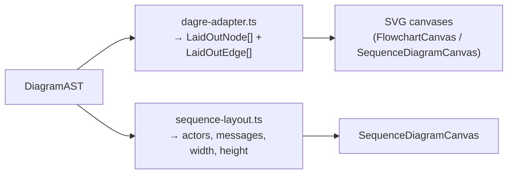

# 10 · Layout Engine

> **What this document covers**: how nodes/edges get their x/y positions — `dagre-adapter.ts`
> (flowcharts), `sequence-layout.ts` (sequence diagrams), plus the shared text measurement &
> wrapping helpers and the layout types.

---

## 1. Two Layout Algorithms, One Goal

Both take the **AST** (see [07-dsl-engine.md](07-dsl-engine.md)) and return **positioned geometry**:



---

## 2. Layout Types — `types.ts` & `sequence-types.ts`

**Files**: `src/lib/layout/types.ts`, `src/lib/layout/sequence-types.ts`

```ts
// flowchart
export interface LaidOutNode extends NodeDecl {
  x: number; y: number; width: number; height: number;
  lines: string[];              // pre-wrapped label lines, ready to render
}
export interface LaidOutEdge {
  from: string; to: string; label?: string;
  points: { x: number; y: number }[];  // polyline waypoints
}

// sequence
export interface LaidOutActor  { id: string; label: string; x: number; width: number }
export interface LaidOutMessage {
  from: string; to: string; label?: string;
  arrowType: 'sync' | 'async'; y: number;
}
export interface SequenceLayoutResult { actors: LaidOutActor[]; messages: LaidOutMessage[]; width: number; height: number }
```

---

## 3. `dagre-adapter.ts` — Flowchart Auto-Layout

**File**: `src/lib/layout/dagre-adapter.ts`

[Dagre](https://github.com/dagrejs/dagre) lays out directed graphs top-to-bottom. The adapter:

1. **Measures each node** with `sizeForLabel(label, iconAttr)` — wraps the label and computes
   width/height using the shared text style constants.
2. **Builds the graph**: `g.setNode(id, { width, height })`, `g.setEdge(from, to, { label })`.
3. **Calls `dagre.layout(g)`** — Dagre positions everything and routes edges.
4. **Converts back** to `LaidOutNode[]`/`LaidOutEdge[]`, converting Dagre's center-based coords to
   top-left-based (`x - width/2`).

```ts
export function dagreLayout(ast: DiagramAST): { nodes: LaidOutNode[]; edges: LaidOutEdge[] } {
  const g = new dagre.graphlib.Graph();
  g.setGraph({ rankdir: 'TB', nodesep: 40, ranksep: 60, marginx: 20, marginy: 20 });

  for (const node of ast.nodes) {
    const sizing = sizeForLabel(node.label, node.attrs.icon);
    g.setNode(node.id, { width: sizing.width, height: sizing.height });
  }
  for (const edge of ast.edges) g.setEdge(edge.from, edge.to, { label: edge.label });

  dagre.layout(g);

  const nodes = ast.nodes.map((node) => {
    const laidOut = g.node(node.id);
    return { ...node, x: laidOut.x - laidOut.width / 2, y: laidOut.y - laidOut.height / 2,
             width: laidOut.width, height: laidOut.height, lines: sizingByNodeId.get(node.id)!.lines };
  });
  const edges = ast.edges.map((edge) => ({
    ...edge, points: g.edge(edge.from, edge.to)?.points ?? [],
  }));
  return { nodes, edges };
}
```

**`sizeForLabel` details** — this is what keeps boxes from overflowing:

```ts
function sizeForLabel(label: string, iconAttr: string | undefined): NodeSizing {
  const hasIcon = resolveIconName(iconAttr) !== null;
  const iconSpace = hasIcon ? ICON_SIZE + ICON_GAP : 0;  // icon eats into width
  let lines = wrapLabel(label, NODE_FONT, NODE_MAX_WIDTH - NODE_PADDING_X - iconSpace);

  if (lines.length > NODE_MAX_LINES) {          // max 3 lines, ellipsis on the last
    lines = lines.slice(0, NODE_MAX_LINES);
    lines[lines.length - 1] = `${lines[lines.length - 1].trimEnd()}…`;
  }

  const widestLine = Math.max(...lines.map((l) => measureTextWidth(l, NODE_FONT)));
  const width  = Math.min(NODE_MAX_WIDTH, Math.max(NODE_MIN_WIDTH, widestLine + NODE_PADDING_X + iconSpace));
  const height = Math.max(NODE_MIN_HEIGHT, lines.length * NODE_LINE_HEIGHT + NODE_PADDING_Y * 2);
  return { width, height, lines, hasIcon };
}
```

---

## 4. `sequence-layout.ts` — Sequence Diagram Layout

**File**: `src/lib/layout/sequence-layout.ts`

A simple, custom layout — no external library:

- **Actors** are placed left-to-right, each centered on its measured width + fixed gap.
- **Messages** are horizontal lines stacked vertically, spaced by `MESSAGE_GAP`.
- Total `width`/`height` are computed so the canvas can size itself.

```ts
const actors: LaidOutActor[] = [];
let cursorX = TOP_MARGIN;
ast.nodes.forEach((node, i) => {
  const width = Math.max(ACTOR_MIN_WIDTH, measureTextWidth(node.label, NODE_FONT) + ACTOR_PADDING_X);
  actors.push({ id: node.id, label: node.label, x: cursorX + width / 2, width });
  cursorX += width + ACTOR_GAP;
});

const messages: LaidOutMessage[] = ast.edges.map((edge, i) => ({
  from: edge.from, to: edge.to, label: edge.label,
  arrowType: edge.arrowType,
  y: HEADER_HEIGHT + TOP_MARGIN + (i + 0.5) * MESSAGE_GAP,
}));
```

---

## 5. `text-measure.ts` — Measuring Text (OffscreenCanvas)

**File**: `src/lib/layout/text-measure.ts`

Measuring text width is needed by both layout and rendering. It uses **`OffscreenCanvas`** — which
works in **both** the main thread *and* Web Workers (a normal `<canvas>` needs a DOM):

```ts
let sharedCtx: OffscreenCanvasRenderingContext2D | null | undefined;

function getContext() {
  if (sharedCtx !== undefined) return sharedCtx;
  if (typeof OffscreenCanvas === 'undefined') { sharedCtx = null; return sharedCtx; }
  const canvas = new OffscreenCanvas(0, 0);
  sharedCtx = canvas.getContext('2d');
  return sharedCtx;
}

export function measureTextWidth(text: string, font: string): number {
  const cacheKey = `${font}::${text}`;          // memoized!
  const cached = cache.get(cacheKey);
  if (cached !== undefined) return cached;
  // ... measure or fall back to a character-width heuristic (0.55 × fontSize × length)
}
```

**Fallback**: if `OffscreenCanvas` isn't available (old Safari, SSR), it estimates width as
`text.length × fontSize × 0.55`.

---

## 6. `wrap-text.ts` — Word Wrapping

**File**: `src/lib/layout/wrap-text.ts`

`wrapLabel(label, font, maxWidth)` implements **greedy word wrap**:

1. Split label into words.
2. Add words to the current line until the next word would exceed `maxWidth`, then start a new line.
3. A word wider than `maxWidth` alone (URLs, long identifiers) is broken per-character via
   `breakLongWord`.

```ts
export function wrapLabel(label: string, font: string, maxWidth: number): string[] {
  const words = label.trim().split(/\s+/).filter(Boolean);
  if (words.length === 0) return [''];
  const lines: string[] = [];
  let currentLine = '';
  for (const word of words) {
    if (measureTextWidth(word, font) > maxWidth) {
      // flush, break the long word, keep last piece as current line...
    } else if (measureTextWidth(`${currentLine} ${word}`, font) <= maxWidth) {
      currentLine += ` ${word}`;
    } else {
      lines.push(currentLine);
      currentLine = word;
    }
  }
  if (currentLine !== '') lines.push(currentLine);
  return lines;
}
```

---

## 7. The Text Style Contract — `text-style.ts`

**File**: `src/lib/render/text-style.ts`

**This file is the single source of truth for fonts.** Both the layout engine (which measures text)
and the SVG renderer (which draws it) import the same constants — if they drifted apart, node boxes
would be sized for a font that isn't the one rendered:

```ts
export const NODE_FONT_SIZE = 13;
export const NODE_FONT_FAMILY = 'ui-sans-serif, system-ui, sans-serif';
export const NODE_FONT = `${NODE_FONT_SIZE}px ${NODE_FONT_FAMILY}`;
export const NODE_LINE_HEIGHT = 16;
export const NODE_PADDING_X = 40;
export const NODE_PADDING_Y = 14;
export const NODE_MIN_WIDTH = 120;
export const NODE_MAX_WIDTH = 280;
export const NODE_MIN_HEIGHT = 50;
export const NODE_MAX_LINES = 3;
// + edge label constants
```

> ⚠️ **Rule**: change font sizes **here**, never in the canvas components directly.

---

## 8. Making Changes

- **Tighten/loosen flowchart spacing** → tweak `g.setGraph({...})` values in `dagre-adapter.ts`.
- **Change node box padding/max width** → `text-style.ts` constants.
- **Change sequence spacing** → constants at the top of `sequence-layout.ts`.
- **Remember**: all these files are imported by `pipeline.worker.ts` → **restart `npm run dev`**
  after editing them!
