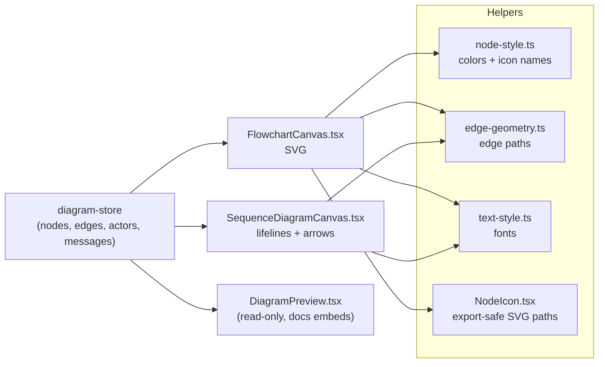
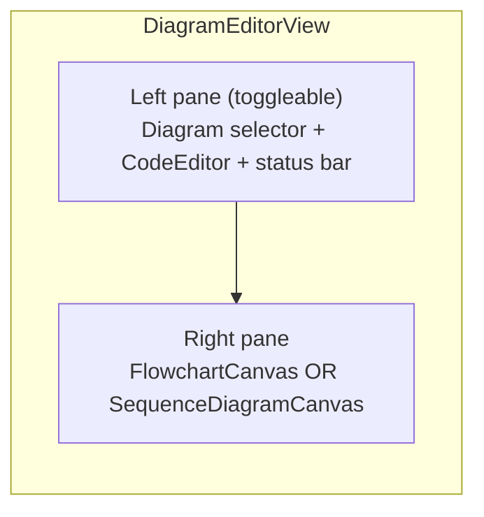

# 11 · Diagram Rendering

> **What this document covers**: how the parsed & laid-out diagram becomes pixels on screen —
> `FlowchartCanvas.tsx`, `SequenceDiagramCanvas.tsx`, `NodeIcon.tsx`, `DiagramEditorView.tsx`,
> and the render helpers (`node-style.ts`, `edge-geometry.ts`).

---

## 1. Rendering Overview



---

## 2. `DiagramEditorView.tsx` — the Diagram Editor Layout

**File**: `src/components/editor/DiagramEditorView.tsx`

The "Diagram-as-Code" tab's body. A two-pane layout:



Key responsibilities:

- Calls `usePipelineWorker()` (this tab also runs the worker).
- A `<select>` dropdown to switch between saved diagrams (registry → `setSource`).
- A **status bar** showing `status` and error/warning counts.
- A "Hide Code" toggle button + a diagram-kind badge (Flowchart / Sequence Diagram).
- Chooses which canvas to render based on `diagramKind`:

```tsx
{diagramKind === 'flowchart' ? <FlowchartCanvas /> : <SequenceDiagramCanvas />}
```

---

## 3. `FlowchartCanvas.tsx` — the Flowchart SVG

**File**: `src/components/editor/FlowchartCanvas.tsx`

A big `<svg>` with a `<g transform="translate(x,y) scale(s)">` for pan/zoom (via `usePanZoom`, see
[17-pan-zoom.md](17-pan-zoom.md)). It renders:

- **Edges** as `<path>` elements (see `EdgeView` below).
- **Nodes** as `<g>` groups with a `<rect>` + optional `<NodeIcon>` + wrapped `<text>` (see
  `NodeView` below).
- An arrowhead `<marker>` in `<defs>`.
- Zoom buttons (`+`/`−`/fit) and a scale indicator.

### NodeView — the draggable node

```tsx
function NodeView({ node, scale, onDrag, onResetPosition }: NodeViewProps) {
  // pointer handlers track drag start; dx/dy divided by `scale` to stay in canvas coords
  const handlePointerMove = (e) => {
    const dx = (e.clientX - dragStart.current.pointerX) / scale;
    const dy = (e.clientY - dragStart.current.pointerY) / scale;
    onDrag(node.id, dragStart.current.nodeX + dx, dragStart.current.nodeY + dy);
  };
  const handleDoubleClick = () => onResetPosition(node.id); // double-click resets to auto-layout
  // ...
  return (
    <g ...>
      <rect x={node.x} y={node.y} width={node.width} height={node.height} rx={8}
            fill="var(--background)" stroke={color?.border ?? 'currentColor'} />
      {hasIcon && <NodeIcon name={iconName} x={...} y={iconY} size={ICON_SIZE} color={color?.accent} />}
      <text x={textCenterX} textAnchor="middle" dominantBaseline="central" fontSize={13}>
        {node.lines.map((line, i) => (
          <tspan key={i} x={textCenterX} y={startY + i * NODE_LINE_HEIGHT}>{line}</tspan>
        ))}
      </text>
    </g>
  );
}
```

**Drag & override flow**: dragging calls `setNodePosition(id, x, y)` on the store, which records
`nodeOverrides[id]` and updates the node. Double-click calls `resetNodePosition` to restore the
auto-layout position.

### EdgeView — the edge with smart path selection

```tsx
function EdgeView({ edge, isDynamic, sourceNode, targetNode }) {
  const points = resolveEdgePoints(edge, isDynamic, sourceNode, targetNode);
  const pathD = pointsToSmoothPath(points);
  const { x: midX, y: midY } = midpointOfPath(points);
  // ...
  return (
    <g>
      <path d={pathD} fill="none" stroke="currentColor" strokeWidth={1.5}
            className="text-foreground/60" markerEnd="url(#arrowhead)" />
      {edge.label && (
        <g> {/* label pill: rect + text at path midpoint */}
          <rect x={midX - labelWidth/2} y={midY - labelHeight/2} ... fill="var(--background)" />
          <text ...>{edge.label}</text>
        </g>
      )}
    </g>
  );
}
```

**`resolveEdgePoints`** picks the right path source (see [edge-geometry](#edge-geometry)):

1. **Self-loop** → `selfLoopPath(node)`.
2. **Node was dragged** (`isDynamic`) → `straightEdgePath(source, target)` (Dagre's old route is
   invalid once a node moves).
3. **Dagre route usable** → use `edge.points` as-is.
4. **Degenerate route** (same-rank siblings) → `sameRankEdgePath`.

`pointsToSmoothPath` converts waypoints into a path with quadratic-curve corners.

---

## 4. `SequenceDiagramCanvas.tsx` — Sequence SVG

**File**: `src/components/editor/SequenceDiagramCanvas.tsx`

Draws actors as header boxes with dashed **lifelines**, and messages as horizontal arrows:

- Sync arrows (`>`) → solid line.
- Async arrows (`-->`) → dashed line.
- Self-messages → a small cubic-bezier loop to the right of the actor.

```tsx
{actors.map((actor) => (
  <line key={`lifeline-${actor.id}`} x1={actor.x} y1={40} x2={actor.x} y2={height}
        strokeDasharray="4 4" className="text-foreground/40" />
))}
{actors.map((actor) => (
  <g key={actor.id}>
    <rect x={actor.x - actor.width/2} y={0} width={actor.width} height={40} rx={8} ... />
    <text x={actor.x} y={20} textAnchor="middle" dominantBaseline="central" fontSize={13}>{actor.label}</text>
  </g>
))}
{/* messages rendered as <line> or self-loop <path> with markerEnd */}
```

It also uses `usePanZoom` with **`fitBounds(width, height)`** since sequence layout returns a
whole-canvas bounding box rather than a node list.

---

## 5. `NodeIcon.tsx` — Export-Safe Icons

**File**: `src/components/editor/NodeIcon.tsx`

Node icons are **hand-copied Lucide SVG path data** rendered as plain `<path>` elements.

> ⚠️ **Why not `lucide-react` icons?** Rendering React icon components inside SVG requires
> `<foreignObject>`, which **taints the canvas** and breaks PNG export (see dev guide). Static path
> data has no such dependency and is guaranteed export-safe.

```tsx
const ICON_PATHS: Record<IconName, string[]> = {
  user: ['M19 21v-2a4 4 0 0 0-4-4H9a4 4 0 0 0-4 4v2', 'M12 11a4 4 0 1 0 0-8 4 4 0 0 0 0 8Z'],
  database: [ /* ... */ ],
  // ... 15 icons
};

export function NodeIcon({ name, x, y, size, color }: NodeIconProps) {
  return (
    <g transform={`translate(${x}, ${y})`}>
      <svg width={size} height={size} viewBox="0 0 24 24" fill="none">
        {paths.map((d, i) => (
          <path key={i} d={d} stroke={color ?? 'currentColor'} strokeWidth={2}
                strokeLinecap="round" strokeLinejoin="round" />
        ))}
      </svg>
    </g>
  );
}
```

---

## 6. Render Helpers

### `node-style.ts` — Colors & Icon Names

**File**: `src/lib/render/node-style.ts`

```ts
export const NODE_COLORS = {
  blue:  { border: '#3b82f6', accent: '#3b82f6' },
  green: { border: '#10b981', accent: '#10b981' },
  // red, amber, purple, gray
};

export const ICON_NAMES = ['user', 'users', 'database', 'server', 'cloud', 'lock',
  'globe', 'mail', 'file', 'folder', 'settings', 'bell', 'shield', 'zap', 'box'];

export function resolveNodeColor(colorAttr?: string) { /* → NODE_COLORS[key] or null */ }
export function resolveIconName(iconAttr?: string)    { /* → ICON_NAMES member or null */ }
```

- `color` and `icon` attributes are **curated lists**, not arbitrary values — keeps diagrams
  visually consistent.
- Unknown names return `null` (validated as warnings in `validator.ts`).

### `edge-geometry.ts` — Edge Path Math

**File**: `src/lib/render/edge-geometry.ts`

Pure geometry helpers used by the flowchart canvas:

| Function | Purpose |
|---|---|
| `clipToRectBoundary(node, towardPoint)` | Finds where the line from a node's center toward another point exits the node's rectangle — so edges start at the border, not the center |
| `straightEdgePath(source, target)` | Straight line between two nodes, clipped to both borders — used when a node was manually dragged |
| `midpointOfPath(points)` | Midpoint by **arc length** — correct for both 2-point and multi-point paths (naively indexing the array picks the wrong point for 2-point paths) |
| `selfLoopPath(node)` | A small loop out to the right of a node and back |
| `sameRankEdgePath(source, target)` | Routes below both boxes with a shallow arc for same-rank sibling edges |
| `isDegenerateRoute(points)` | True when Dagre's points are too sparse or start≈end |

---

## 7. The Read-Only Preview (`DiagramPreview.tsx`)

**File**: `src/components/docs/DiagramPreview.tsx`

Used by the **docs editor** embeds (see [13-docs-editor.md](13-docs-editor.md)). It runs
`runPipelineSync(source)` (main-thread, no worker) and renders a simplified read-only SVG —
polyline edges, rect nodes, wrapped text — with a `viewBox` computed from the node bounds. On
error it shows a red error box instead.
