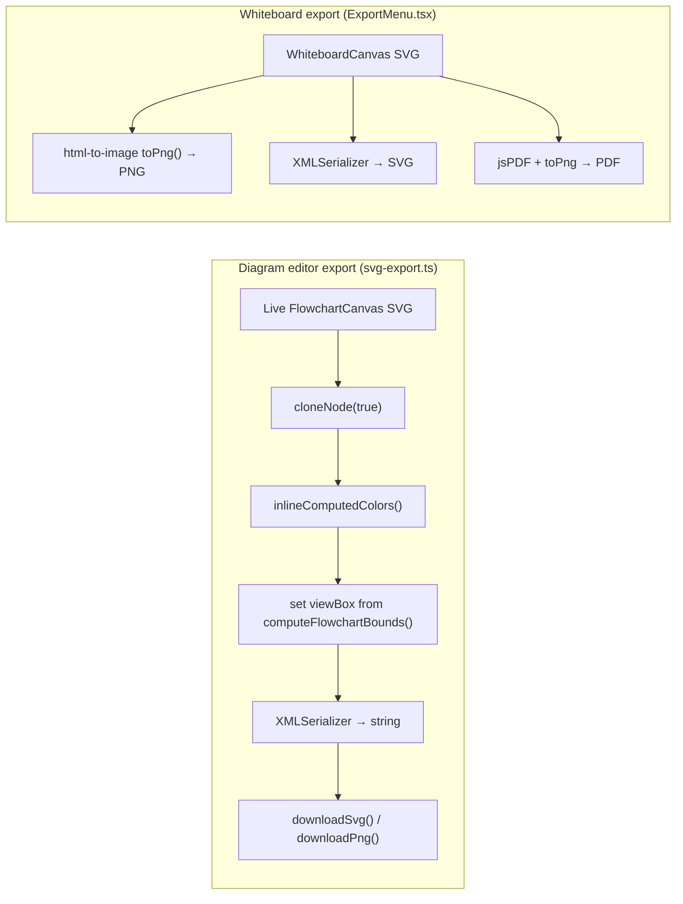

# 12 · SVG & PNG Export

> **What this document covers**: how diagrams are exported to SVG and PNG files —
> `src/lib/export/svg-export.ts` (used by the diagram editor) and the whiteboard's own
> `ExportMenu.tsx`.

---

## 1. Two Export Paths



---

## 2. Why Exporting SVG Is Tricky

The on-screen SVG uses **Tailwind classes** and **CSS variables** (`var(--background)`,
`currentColor`, `text-foreground/60`). When you serialize it into a standalone `.svg` file, there's
no stylesheet attached — so those all resolve to **nothing**, and everything falls back to SVG's
default **black fill**.

`svg-export.ts` solves this by **inlining the computed colors**:

```ts
function inlineComputedColors(sourceRoot: SVGSVGElement, cloneRoot: SVGSVGElement) {
  const sourceEls = sourceRoot.querySelectorAll<SVGElement>('*');
  const cloneEls = cloneRoot.querySelectorAll<SVGElement>('*');

  sourceEls.forEach((sourceEl, i) => {
    const cloneEl = cloneEls[i];
    if (!cloneEl) return;
    const computed = window.getComputedStyle(sourceEl);  // resolves all vars/classes

    if (computed.fill && computed.fill !== 'none') cloneEl.setAttribute('fill', computed.fill);
    if (computed.stroke && computed.stroke !== 'none') cloneEl.setAttribute('stroke', computed.stroke);
  });
}
```

`getComputedStyle` on the **live** elements resolves everything correctly, so we just transfer
those resolved values onto the clone as explicit attributes.

---

## 3. `serializeForExport` — the Main Function

**File**: `src/lib/export/svg-export.ts`

```ts
export function serializeForExport(svgEl: SVGSVGElement, bounds: ExportBounds): string {
  const clone = svgEl.cloneNode(true) as SVGSVGElement;

  inlineComputedColors(svgEl, clone);              // 1. inline resolved colors

  const transformGroup = clone.querySelector('g');
  if (transformGroup) transformGroup.removeAttribute('transform'); // 2. strip pan/zoom

  const minX = bounds.minX - EXPORT_PADDING;       // 3. compute viewBox with padding
  const minY = bounds.minY - EXPORT_PADDING;
  const width = bounds.width + EXPORT_PADDING * 2;
  const height = bounds.height + EXPORT_PADDING * 2;

  clone.setAttribute('viewBox', `${minX} ${minY} ${width} ${height}`);
  clone.setAttribute('width', String(width));
  clone.setAttribute('height', String(height));
  clone.removeAttribute('class');                  // 4. drop Tailwind classes

  const bgRect = document.createElementNS('http://www.w3.org/2000/svg', 'rect'); // 5. white bg
  bgRect.setAttribute('fill', '#ffffff');
  // ...sized to bounds, inserted first
  clone.insertBefore(bgRect, clone.firstChild);

  return new XMLSerializer().serializeToString(clone);
}
```

### Bounds computation

`computeFlowchartBounds(nodes)` returns the tight bounding box of all nodes (plus padding) so the
export shows the **whole diagram**, not just the current viewport. Returns a default 400×300 box if
empty.

---

## 4. Downloading

```ts
export function downloadSvg(svgString: string, filename: string) {
  triggerDownload(new Blob([svgString], { type: 'image/svg+xml;charset=utf-8' }), filename);
}

export async function downloadPng(svgString, pixelWidth, pixelHeight, filename, scale = 2) {
  // 1. Blob URL from the SVG string
  // 2. Load it into an 
  // 3. Draw onto a 2× canvas (scale = 2 for crispness)
  // 4. canvas.toBlob('image/png') → triggerDownload
}

function triggerDownload(blob: Blob, filename: string) {
  const url = URL.createObjectURL(blob);
  const a = document.createElement('a');
  a.href = url; a.download = filename;
  document.body.appendChild(a); a.click();
  document.body.removeChild(a);
  URL.revokeObjectURL(url);
}
```

---

## 5. How the Editor Wires It Up

The `svgElement` is captured by the canvas components into the diagram store
(`setSvgElement(svgRef.current)`), so any toolbar/export UI can grab the live SVG:

```ts
// FlowchartCanvas.tsx
useEffect(() => {
  setSvgElement(svgRef.current);
  return () => setSvgElement(null);
}, [svgRef, setSvgElement]);
```

The export flow is then: `serializeForExport(useDiagramStore.getState().svgElement, computeFlowchartBounds(nodes))`
→ `downloadSvg` / `downloadPng`.

> ⚠️ Note: the whiteboard's `ExportMenu.tsx` uses a **simpler** approach (html-to-image `toPng`,
> plain SVG serialization, jsPDF for PDF). It doesn't go through `svg-export.ts` — two separate
> code paths exist today.

---

## 6. Export Safety Rules (from the dev guide)

1. **No `<foreignObject>`** in exported SVG — it taints the canvas and breaks PNG rasterization.
2. **Icons = static SVG paths** (`NodeIcon.tsx`); never mount React icon components inside the SVG.
3. **Never hardcode** `stroke="#000000"` / `#ffffff` in render components — use theme-aware
   `currentColor` + Tailwind opacity classes, then rely on `inlineComputedColors` at export time.
