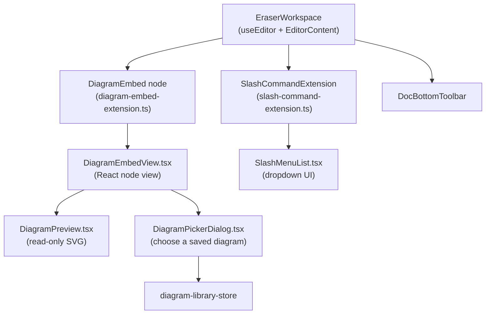
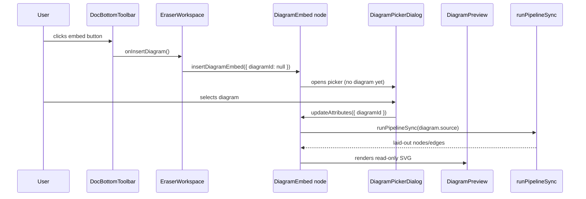

# 13 · Docs Editor (Tiptap)

> **What this document covers**: the rich-text document editor — `EraserWorkspace`'s Tiptap
> setup, the custom `DiagramEmbed` node, the slash-command menu, the bottom formatting toolbar,
> and the diagram picker dialog.

---

## 1. Feature Overview



**Tiptap** is a React wrapper around **ProseMirror**. Custom block types are added via
*extensions*, and extensions can mount *React components* for their UI.

---

## 2. Setting Up the Editor (in `EraserWorkspace.tsx`)

```tsx
const editor = useEditor({
  extensions: [
    StarterKit,                                      // headings, lists, code blocks, etc.
    Placeholder.configure({ placeholder: 'Type your notes or document here...' }),
    DiagramEmbed,                                    // 👈 custom block node
    SlashCommandExtension,                           // 👈 "/" menu
  ],
  content: '<h1 class="text-2xl font-bold mb-4">Untitled File</h1><p></p>',
  immediatelyRender: false,  // ⚠️ REQUIRED — prevents SSR hydration mismatch
});
```

> ⚠️ **Tiptap + SSR rule**: always pass `immediatelyRender: false` in `useEditor()`, or Next.js
> server-rendering will throw hydration errors.

---

## 3. `diagram-embed-extension.ts` — the Custom Node

**File**: `src/components/docs/diagram-embed-extension.ts`

Defines a new **atomic block node** named `diagramEmbed`:

```ts
export const DiagramEmbed = Node.create<DiagramEmbedOptions>({
  name: 'diagramEmbed',
  group: 'block',
  atom: true,                       // no children — a single unit

  addAttributes() {
    return { diagramId: { default: null } };   // which saved diagram to show
  },

  parseHTML()      { return [{ tag: 'div[data-diagram-embed]' }]; },
  renderHTML({ HTMLAttributes }) {
    return ['div', mergeAttributes({ 'data-diagram-embed': '' }, HTMLAttributes)];
  },

  addNodeView() {
    return ReactNodeViewRenderer(DiagramEmbedView);  // 👈 render React inside ProseMirror
  },

  addCommands() {
    return {
      insertDiagramEmbed: (attrs) => ({ commands }) =>
        commands.insertContent({ type: this.name, attrs }),
    };
  },
});
```

It also declares the TypeScript command type so `editor.chain().focus().insertDiagramEmbed({...})`
type-checks.

---

## 4. `DiagramEmbedView.tsx` — the Node's UI

**File**: `src/components/docs/DiagramEmbedView.tsx`

A React **node view** that shows:

- If a diagram is selected → its **name** + a "Change" button + `<DiagramPreview source={...} />`.
- If not → "No diagram selected" + a **Choose diagram** button.
- Both open `DiagramPickerDialog`, and selecting a diagram calls
  `updateAttributes({ diagramId: id })` (the Tiptap way to mutate the node's data).

```tsx
export function DiagramEmbedView({ node, updateAttributes }: NodeViewProps) {
  const diagramId = node.attrs.diagramId as string | null;
  const diagram = useDiagramLibraryStore((s) => (diagramId ? s.getDiagram(diagramId) : undefined));
  const [pickerOpen, setPickerOpen] = useState(false);

  return (
    <NodeViewWrapper className="my-2 rounded-md border p-3">
      {diagram ? (
        <>
          <div className="mb-2 flex items-center justify-between">
            <span>{diagram.name}</span>
            <Button variant="ghost" size="sm" onClick={() => setPickerOpen(true)}>
              <Pencil /> Change
            </Button>
          </div>
          <DiagramPreview source={diagram.source} />
        </>
      ) : (
        <div className="flex items-center justify-between">
          <span>No diagram selected</span>
          <Button variant="outline" size="sm" onClick={() => setPickerOpen(true)}>
            Choose diagram
          </Button>
        </div>
      )}

      <DiagramPickerDialog open={pickerOpen} onOpenChange={setPickerOpen}
        onSelect={(id) => { updateAttributes({ diagramId: id }); setPickerOpen(false); }} />
    </NodeViewWrapper>
  );
}
```

---

## 5. `DiagramPreview.tsx` — the Read-Only SVG

**File**: `src/components/docs/DiagramPreview.tsx` (detailed in [11-diagram-rendering.md](11-diagram-rendering.md))

Runs `runPipelineSync(source)` with `useMemo` (only re-runs when `source` changes), then renders a
simplified SVG. If `!result.ok`, it shows a red error box — so broken diagrams don't crash the doc.

---

## 6. `DiagramPickerDialog.tsx` — Choose a Diagram

**File**: `src/components/docs/DiagramPickerDialog.tsx`

A shadcn `Dialog` listing saved diagrams from `useDiagramLibraryStore`:

```tsx
export function DiagramPickerDialog({ open, onOpenChange, onSelect }: DiagramPickerDialogProps) {
  const diagrams = useDiagramLibraryStore((s) => s.diagrams);
  return (
    <Dialog open={open} onOpenChange={onOpenChange}>
      <DialogContent>
        <DialogHeader><DialogTitle>Choose a diagram</DialogTitle></DialogHeader>
        {diagrams.length === 0
          ? <p>No saved diagrams yet — go to the diagram editor and save one first.</p>
          : diagrams.map((d) => (
              <Button key={d.id} variant="ghost" className="justify-start"
                      onClick={() => onSelect(d.id)}>
                {d.name}
              </Button>
            ))}
      </DialogContent>
    </Dialog>
  );
}
```

---

## 7. Slash Commands (`/`)

### The extension — `slash-command-extension.ts`

Uses Tiptap's `Suggestion` plugin with `char: '/'`. Typing `/` pops up the menu; the extension
renders `SlashMenuList` via `ReactRenderer` inside a `fixed` positioned container:

```ts
Suggestion({
  editor: this.editor,
  char: '/',
  items: ({ query }) =>
    SLASH_COMMANDS.filter((item) =>
      item.title.toLowerCase().includes(query.toLowerCase()) ||
      item.description.toLowerCase().includes(query.toLowerCase())),
  render: () => {
    let component: ReactRenderer<SlashMenuListRef> | null = null;
    let container: HTMLDivElement | null = null;
    return {
      onStart(props)   { component = new ReactRenderer(SlashMenuList, { props, editor: props.editor }); /* position container */ },
      onUpdate(props)  { component?.updateProps(props); /* reposition */ },
      onKeyDown(props) { /* Escape → destroy; else forward to component ref */ },
      onExit()         { /* remove container, destroy component */ },
    };
  },
})
```

### The menu — `SlashMenuList.tsx`

Defines `SLASH_COMMANDS` (an array of `CommandItem`s) and renders the dropdown:

| Command | Behavior |
|---|---|
| Diagram Embed | deletes the `/` text, inserts a `diagramEmbed` node |
| Heading 1/2/3 | `clearNodes().toggleHeading({ level })` |
| Bullet / Numbered list | `toggleBulletList()` / `toggleOrderedList()` |
| Code Block | `toggleCodeBlock()` |
| Quote | `toggleBlockquote()` |
| Divider | `setHorizontalRule()` |

```tsx
export const SLASH_COMMANDS: CommandItem[] = [
  {
    title: 'Heading 2',
    description: 'Medium section heading.',
    icon: Heading2,
    command: ({ editor, range }) => {
      editor.chain().focus().deleteRange(range).run();
      editor.chain().focus().clearNodes().toggleHeading({ level: 2 }).run();
    },
  },
  // ...
];
```

The component is `forwardRef` with `useImperativeHandle` exposing `onKeyDown` for arrow-key
navigation and Enter-to-select — this is how the ProseMirror plugin talks to the React list.

---

## 8. `DocBottomToolbar.tsx` — the Floating Formatting Bar

**File**: `src/components/docs/DocBottomToolbar.tsx`

A floating bottom-center bar of icon buttons that call Tiptap chain commands:

```tsx
<Button onClick={() => editor.chain().focus().toggleHeading({ level: 2 }).run()}>Heading</Button>
<Button onClick={() => editor.chain().focus().toggleBulletList().run()}>Bullet List</Button>
<Button onClick={() => editor.chain().focus().toggleCodeBlock().run()}>Code Block</Button>
<Button onClick={() => editor.chain().focus().toggleBlockquote().run()}>Quote</Button>
<Button onClick={onInsertDiagram}>Embed Diagram</Button>  // → insertDiagramEmbed({ diagramId: null })
```

Buttons highlight when the active node matches (`editor.isActive('bulletList') ? 'secondary' : 'ghost'`).

---

## 9. How "Insert Diagram" Wires Together



---

## 10. Gotchas

- `immediatelyRender: false` is mandatory in `useEditor`.
- The slash menu container is appended to `document.body` with `position: fixed` — remember to
  clean it up in `onExit` / on Escape.
- Diagram embeds reference diagrams **by id**. If a diagram is deleted from the registry, the
  embed shows "No diagram selected" (the lookup returns `undefined`).
