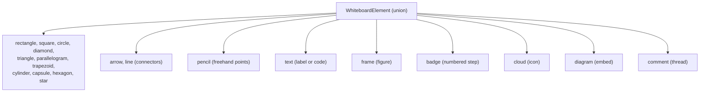
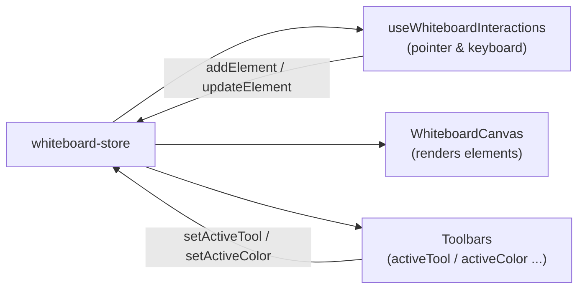

# 14 · Whiteboard Core

> **What this document covers**: the heart of the freeform canvas — the element type system
> (`whiteboard-types.ts`) and the giant store (`whiteboard-store.ts`).

---

## 1. Concept: Everything Is a "Whiteboard Element"

The whiteboard renders a single array of **elements** (`elements: WhiteboardElement[]`). Each
element is a discriminated union keyed by `type`:



**File**: `src/lib/whiteboard/whiteboard-types.ts`

---

## 2. The Element Types

### BaseElement — shared fields

```ts
export interface BaseElement {
  id: string;
  x: number; y: number;       // top-left position
  width: number; height: number;
  strokeColor: string;
  fillColor?: string;
  strokeWidth: number;
  groupId?: string;           // for group/ungroup
  label?: string;
}
```

### Connectors (arrow / line)

```ts
export interface ArrowElement extends BaseElement {
  type: 'arrow';
  startX: number; startY: number;   // endpoint 1
  endX: number; endY: number;       // endpoint 2
  routingStyle?: 'orthogonal' | 'straight' | 'curved';
  lineStyle?: LineStyle;            // solid | dashed | dotted | dash-dot
  arrowheadStyle?: ArrowheadStyle;  // arrow | triangle | diamond | circle | none
  startArrowheadStyle?: ArrowheadStyle;
  fromElementId?: string;           // connected to shape?
  fromPort?: PortDirection;         // 'top' | 'bottom' | 'left' | 'right'
  toElementId?: string;
  toPort?: PortDirection;
  waypoint?: Point;                 // manual bend (curved only)
  isAnimated?: boolean;             // animated flow-dash
}
```

### Text & code

```ts
export interface TextElement extends BaseElement {
  type: 'text';
  text: string;
  fontSize: number;
  fontFamily?: string;
  fontWeight?: 'normal' | 'bold';
  fontStyle?: 'normal' | 'italic';
  textAlign?: 'left' | 'center' | 'right';
  mode?: 'text' | 'code';           // code mode renders CodeMirror
  language?: string;
  textWrap?: boolean;
}
```

### Others

- `PencilElement` — `points: Point[]` (freehand stroke).
- `FrameElement` — a titled "figure" container that can hold children.
- `BadgeElement` — `number` (a step badge).
- `CloudIconElement` — `iconKind` (an icon catalog id).
- `DiagramElement` — `diagramId` (embeds a saved diagram).
- `CommentElement` — `text`, `author`, `resolved`, `replies[]`, `isDraft`.

---

## 3. Helper Functions (same file)

| Function | Purpose |
|---|---|
| `isPolygonShapeType(type)` | Is it one of the 11 polygon shapes? |
| `isDrawableTool(tool)` | Can this tool draw with a drag? |
| `isConnectorElement(el)` | `type === 'arrow' \|\| type === 'line'` |
| `getShapePorts(el)` | The 4 cardinal port positions (top/bottom/left/right) of an element — used for arrow snapping |
| `getElementBounds(el)` | The bounding box — handles connectors (min/max of endpoints) and pencil (min/max of points) specially |
| `computeTextElementSize(text, fontSize, mode)` | Estimates text-box size based on char width × line height |
| `computeShapeAutoHeight(text, width, currentHeight, fontSize)` | Grows a shape's height to fit wrapped label text |

```ts
export const WHITEBOARD_COLORS: Record<WhiteboardColor, { bg: string; border: string; text: string }> = {
  blue:  { bg: 'rgba(59, 130, 246, 0.12)', border: '#3b82f6', text: 'var(--foreground)' },
  green: { bg: 'rgba(34, 197, 94, 0.12)',  border: '#22c55e', text: 'var(--foreground)' },
  // ...
};
```

---

## 4. `whiteboard-store.ts` — the Giant Store

**File**: `src/lib/store/whiteboard-store.ts`

### 4.1 What it holds (abridged)

```ts
interface WhiteboardStore {
  // active style
  activeTool: WhiteboardTool;            // 'select' | 'rectangle' | ...
  activeColor: WhiteboardColor;
  activeStrokeHex: string;               // 'currentColor' by default
  activeFillHex: string;                 // 'transparent' by default
  activeStrokeWidth: number;
  activeLineWidthSize: 'S' | 'M' | 'L' | 'XL';
  activeLineStyle: LineStyle;
  activeArrowheadStyle: ArrowheadStyle;
  activeStartArrowheadStyle: ArrowheadStyle;
  activeRoutingStyle: RoutingStyle;
  activeIsAnimated: boolean;
  activeCornerRadius: number;
  activeFillStyle: 'plain' | 'watercolor';

  // document
  elements: WhiteboardElement[];
  selectedIds: string[];
  history: HistoryState[];               // undo stack (elements snapshots)
  future: HistoryState[];                // redo stack
  clipboard: WhiteboardElement[];

  // view
  showGrid: boolean;
  hideUI: boolean;
  showComments: boolean;

  // actions (30+)
  // ...
}
```

### 4.2 Undo/redo — snapshot stacks

Most mutating actions (`addElement`, `updateElement`, `deleteElements`, `duplicateSelected`,
`pasteFromClipboard`, `spawnConnectedNode`, `reconnectArrowEndpoint`) first push the **previous**
elements into `history`, then clear `future`. **Exception**: `moveSelectedElements` and
`resizeElement` do **not** push history — they return only `{ elements }`. In practice this means
a pure element **drag** never captures its own history entry (undo after a drag reverts to the
state before the previous history entry), while a **resize** captures history on the first pointer
move because `useWhiteboardInteractions` fires `updateElement(targetId, { isUserResized: true })`
during the resize:

```ts
function pushHistory(state) {
  const newHistory = [...state.history, { elements: state.elements }];
  if (newHistory.length > 100) newHistory.shift();  // cap at 100 steps
  return newHistory;
}

undo: () => set((state) => {
  if (state.history.length === 0) return state;
  const previous = state.history[state.history.length - 1];
  const newHistory = state.history.slice(0, -1);
  saveElements(previous.elements);
  return { history: newHistory, future: [{ elements: state.elements }, ...state.future],
           elements: previous.elements, canUndo: newHistory.length > 0, canRedo: true };
}),

redo: () => set((state) => { /* mirror image of undo */ }),
```

### 4.3 localStorage persistence (debounced)

```ts
const STORAGE_KEY = 'eraser-whiteboard-elements';

function saveElements(elements: WhiteboardElement[]) {
  if (typeof window === 'undefined') return;
  if (_saveTimer) clearTimeout(_saveTimer);
  _saveTimer = setTimeout(() => {
    try { localStorage.setItem(STORAGE_KEY, JSON.stringify(elements)); }
    catch { /* quota exceeded or SSR — ignore */ }
  }, 300); // debounced — state updates instantly, only persistence is throttled
}

hydrate: () => {
  if (typeof window === 'undefined') return;
  const stored = loadElements();
  if (stored.length > 0) set({ elements: stored });
},
```

### 4.4 Connector-aware updates

`updateElement` clears `waypoint` unless the connector is curved:

```ts
updateElement: (id, patch) => set((state) => {
  const history = pushHistory(state);
  const elements = state.elements.map((el) => {
    if (el.id !== id) return el;
    const updated = { ...el, ...patch } as WhiteboardElement;
    if (isConnectorElement(updated) && updated.routingStyle !== 'curved') {
      delete (updated as any).waypoint;  // straight/orthogonal don't use waypoints
    }
    return updated;
  });
  saveElements(elements);
  return { history, future: [], elements, canUndo: true, canRedo: false };
});
```

`moveSelectedElements` and `resizeElement` also **re-rout connectors** to attached shapes using
`getOptimalPortPair`/`getOptimalSinglePort` (see [18-orthogonal-routing.md](18-orthogonal-routing.md)).

### 4.5 Other notable actions

| Action | What it does |
|---|---|
| `spawnConnectedNode(sourceId, direction)` | Creates a copy of the source shape 120px away in a direction, plus an arrow connecting the two (used by Tab key) |
| `reconnectArrowEndpoint(arrowId, endpoint, targetPos, targetElementId, targetPort)` | Re-attaches an arrow endpoint to a shape/port and re-routes |
| `duplicateSelected` / `pasteFromClipboard` | Duplicate with an id remap so connectors re-point at the new copies |
| `bringToFront` / `sendToBack` | Reorders the elements array (later = on top) |
| `alignLeft/Center/Right/Top/Middle/Bottom` | Aligns selected elements |
| `groupSelected` / `ungroupSelected` | Sets/clears `groupId` on selected elements |
| Comment actions | `toggleResolvedComment`, `addCommentReply`, `editCommentText`, `deleteCommentReply` |

---

## 5. Frames Move Their Children

Both `moveSelectedElements` and `duplicateSelected` detect **children inside a frame** (by bounds
containment, with a 5px tolerance) and include them in the move/duplicate set:

```ts
const selectedFigures = state.elements.filter((el) => state.selectedIds.includes(el.id) && el.type === 'frame');
selectedFigures.forEach((fig) => {
  state.elements.forEach((child) => {
    if (child.id !== fig.id) {
      const b = getElementBounds(child);
      const isInside = b.x >= fig.x - 5 && b.x + b.width <= fig.x + fig.width + 5 &&
                       b.y >= fig.y - 5 && b.y + b.height <= fig.y + fig.height + 5;
      if (isInside) idsToMove.add(child.id);
    }
  });
});
```

---

## 6. How Components Use It



The store is the single source of truth — the canvas never mutates elements directly; it always
goes through store actions so undo/redo and persistence stay consistent.
