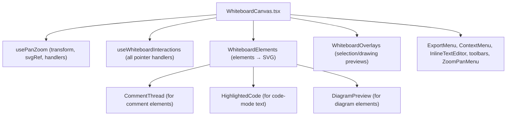
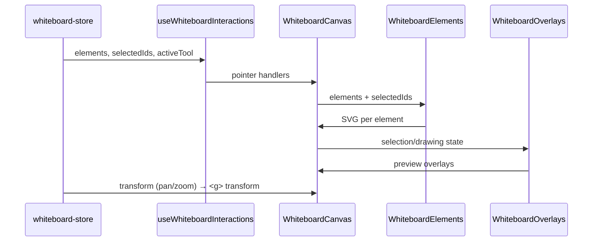

# 15 · Whiteboard Canvas & Rendering

> **What this document covers**: how the freeform canvas is put together —
> `WhiteboardCanvas.tsx` (the SVG shell), `WhiteboardElements.tsx` (renders every element),
> and `WhiteboardOverlays.tsx` (selection, resize, drawing previews).

---

## 1. Component Hierarchy



The **big idea**: one `<svg>` with a `<g transform="translate(x,y) scale(s)">` that holds
everything. Pan/zoom just changes that transform.

---

## 2. `WhiteboardCanvas.tsx` — the Shell

**File**: `src/components/whiteboard/WhiteboardCanvas.tsx`

### 2.1 The SVG and its transform

```tsx
const { transform, svgRef, handlers, setTransform, zoomIn, zoomOut, reset, fitToContent } = usePanZoom();
const { /* handlers from */ } = useWhiteboardInteractions({ transform, setTransform, svgRef, reset, fitToContent, panZoomHandlers: handlers });

<svg ref={svgRef} className="h-full w-full touch-none"
     onWheel={handlers.onWheel}
     onPointerDown={handlePointerDown}
     onPointerMove={handlePointerMove}
     onPointerUp={handlePointerUp}
     onDoubleClick={handleCanvasDoubleClick}
     onContextMenu={...}>
  <defs>{/* grid pattern + arrowhead markers */}</defs>
  {showGrid && <rect width="100%" height="100%" fill="url(#wb-grid)" />}
  <g transform={`translate(${transform.x}, ${transform.y}) scale(${transform.scale})`}>
    <WhiteboardElements ... />
    {editingElementId && <InlineTextEditor ... />}
    <WhiteboardOverlays ... />
  </g>
</svg>
```

### 2.2 The grid

```tsx
{showGrid && (
  <pattern id="wb-grid" width={GRID_SIZE} height={GRID_SIZE} patternUnits="userSpaceOnUse"
           patternTransform={`translate(${transform.x}, ${transform.y}) scale(${transform.scale})`}>
    <circle cx={GRID_SIZE / 2} cy={GRID_SIZE / 2} r={1} fill="currentColor" className="text-foreground/10" />
  </pattern>
)}
```

`GRID_SIZE = 24` comes from the store. The pattern transform keeps dots aligned while panning.

### 2.3 Arrowhead markers

`<defs>` declares many markers: generic ones (`wb-arrowhead*`) plus **per-color** variants
(`wb-arrowhead-${colorId}`) generated from `STROKE_COLOR_PALETTE` + all stroke colors used by
current elements — this is what lets arrows of different colors have matching arrowheads.

### 2.4 Double-click to add text

`handleCanvasDoubleClick` checks the click hit a "canvas-ish" element (svg/rect/path/pattern/
circle), then creates a new `TextElement` at the canvas coordinates and immediately opens
`InlineTextEditor` on it.

### 2.5 The floating action column

Bottom-right utility stack: grid toggle, zoom-to-fit (Shift+1), zoom-to-selection (Shift+2),
duplicate/copy/paste (when selection), group/ungroup (when multi-selection), and export.

### 2.6 Zoom percent pop animation

`transform.scale` is watched; when it changes, the zoom badge pops in/out using
`zoomAnimState: 'idle' | 'pop-in' | 'pop-out'` with timers.

---

## 3. `WhiteboardElements.tsx` — Rendering Every Element

**File**: `src/components/whiteboard/WhiteboardElements.tsx`

Takes `elements` and maps each to SVG. Important details:

### 3.1 Frames render underneath

```tsx
const sortedElements = [...elements].sort((a, b) => {
  if (a.type === 'frame' && b.type !== 'frame') return -1;  // frames first (behind)
  if (a.type !== 'frame' && b.type === 'frame') return 1;
  return 0;
});
```

### 3.2 Polygon shapes

Each of the 11 polygon types renders a specific SVG element (`rect`, `ellipse`, `polygon`, ...),
honoring `fillColor`, `strokeColor`, `strokeWidth`, `lineStyle` (via `LINE_DASH`), and
`fillStyle` (`'watercolor'` → `fillOpacity: 0.75`).

```tsx
const dashArray = getStrokeDasharray(el);   // LINE_DASH[lineStyle] → "8 4" etc.
// rectangle: <rect rx={4} .../>
// circle:    <ellipse rx={w/2} ry={h/2} .../>
// diamond:   <polygon points={cx,top right,cx bottom,left} .../>
// ... etc for triangle, parallelogram, trapezoid, cylinder, capsule, hexagon, star
```

### 3.3 Connectors (arrow / line)

`renderConnector(el, showArrowhead)` picks the path per routing style:

```ts
const pathD = el.routingStyle === 'straight'
  ? `M ${el.startX} ${el.startY} L ${el.endX} ${el.endY}`
  : el.routingStyle === 'curved'
    ? getCurvedPathD(el.startX, el.startY, el.endX, el.endY, waypoint)
    : getDirectionalOrthogonalPathD(el.startX, el.startY, el.endX, el.endY, fromPort, toPort);
```

- An **invisible 24px-wide hit path** makes the thin line easy to grab.
- Arrowhead markers chosen via `getMarkerId(style, color)` / `getStartMarkerId(style, color)`.
- `el.isAnimated` adds `animate-flow-dash` (CSS keyframe) for animated flow arrows.
- Selected connectors show draggable endpoint handles (`renderConnectorHandles`): start circle,
  end circle, and (curved only) a waypoint handle that can be double-clicked to reset.

### 3.4 Cloud icons

Renders the icon from `ICON_MAP` (see [19-whiteboard-toolbars.md](19-whiteboard-toolbars.md)) inside
a `<foreignObject>` with adaptive stroke width:

```tsx
const computedStrokeWidth = Math.max(1.0, Math.min(1.8, 1.15 * Math.pow(Math.max(32, elementWidth) / 64, 0.25)));
```

> ⚠️ The whiteboard **does** use `foreignObject` (unlike the diagram editor) because it never
> exports via `serializeForExport`. Whiteboard export uses html-to-image, which can rasterize
> foreignObject.

### 3.5 Text elements

- Text mode → `<foreignObject>` with a `<textarea>`/content-editable via `InlineTextEditor` when
  editing; otherwise plain `<text>`/`<tspan>` wrapping.
- Code mode → `HighlightedCode` (CodeMirror read-only) inside a dark box (see
  [19-whiteboard-toolbars.md](19-whiteboard-toolbars.md) for `code-highlighter.tsx`).

### 3.6 Comments

Comment elements render `<CommentThread>` (see [19-whiteboard-toolbars.md](19-whiteboard-toolbars.md))
unless `showComments` is off.

### 3.7 Diagram embeds

Diagram elements render `<DiagramPreview source={registry.diagrams[id].source} />`.

---

## 4. `WhiteboardOverlays.tsx` — Selection & Previews

**File**: `src/components/whiteboard/WhiteboardOverlays.tsx`

Draws everything that is *not* a saved element:

| Overlay | Description |
|---|---|
| **Live drawing preview** | While dragging with a shape/arrow/pencil/cloud/comment tool, a dashed preview follows the cursor (per-tool geometry: rect, ellipse, polygon, path, ...) |
| **Quick-connect preview** | Dashed arrow from a port while dragging a `+` handle |
| **Endpoint drag preview** | Dashed arrow + live label while re-attaching an arrow endpoint |
| **Snap ring** | A highlighted ring at the snapped port (`activeSnap`) |
| **Selection box** | The marquee rectangle while box-selecting |
| **Selection bounds + resize handles** | Dashed bounding box with 8 handles (corner-only for cloud icons — 1:1 aspect) |
| **Quick-connect `+` handles** | Hoverable handles on the 4 sides of a single selected shape — drag to connect, click to spawn a connected node |

```tsx
// Selection box (marquee)
{selectionBox && (
  <rect x={Math.min(start.x, current.x)} y={Math.min(start.y, current.y)}
        width={Math.abs(current.x - start.x)} height={Math.abs(current.y - start.y)}
        fill="var(--canvas-accent)" fillOpacity={0.08} stroke="var(--canvas-accent)"
        strokeDasharray="3 3" />
)}
```

```tsx
// Resize handles — 8 positions with per-handle cursor
{['tl','tc','tr','ml','mr','bl','bc','br']
  .filter((h) => el.type !== 'cloud' || ['tl','tr','bl','br'].includes(h.handle))
  .map((h) => (
    <rect key={h.handle} x={h.x} y={h.y} width={8} height={8}
          fill="var(--background)" stroke="var(--canvas-accent)"
          className={h.cursor}   // e.g. 'cursor-nwse-resize'
          onPointerDown={(e) => onResizeHandlePointerDown(e, h.handle as ResizeHandle, el.id)} />
  ))}
```

> 💡 `var(--canvas-accent)` is a theme-aware accent color defined in `globals.css` — all overlay
> chrome uses it, so the UI stays consistent in light & dark mode.

---

## 5. How It All Renders (data → pixels)



---

## 6. Gotchas

- Elements later in the `elements` array paint **on top** (except frames, sorted first).
- Overlays must be `pointer-events-none` (or use `stopPropagation`) so they don't block element
  interaction.
- `foreignObject` is fine here but **never** in the diagram editor's export path.
