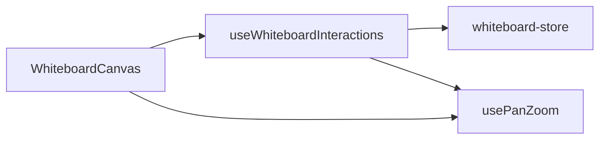
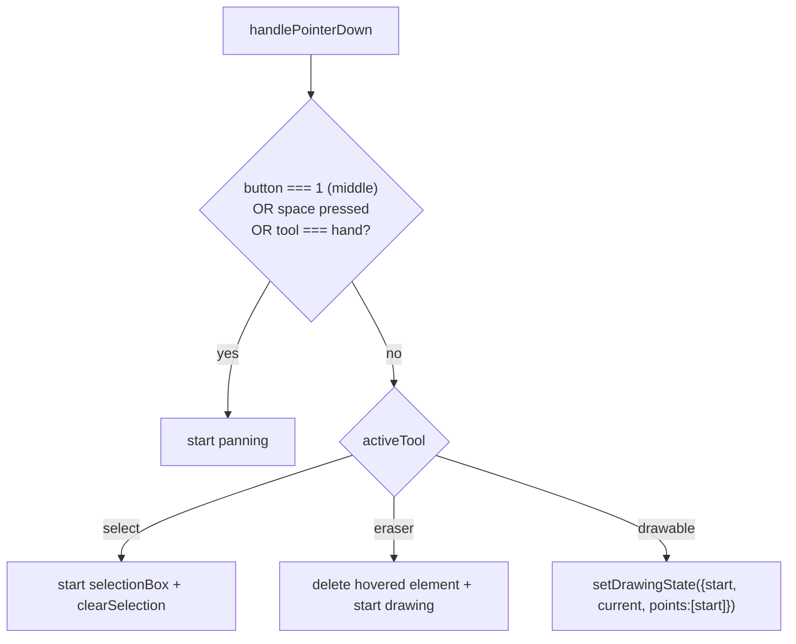

# 16 · Whiteboard Interactions

> **What this document covers**: `useWhiteboardInteractions.ts` — the giant hook that turns
> pointer events and keyboard presses into store actions. This is where drawing, dragging,
> selecting, panning, and all shortcuts live.

---

## 1. Role of the Hook

The hook is called once by `WhiteboardCanvas`, which passes in the pan/zoom pieces (`transform`,
`setTransform`, `svgRef`, `reset`, `fitToContent`, `panZoomHandlers`). It returns the handlers +
state the canvas spreads onto the `<svg>`:

```tsx
const {
  handlePointerDown, handlePointerMove, handlePointerUp,
  handleElementClick, handleElementDoubleClick,
  handleElementPointerDown, handleResizeHandlePointerDown,
  drawingState, selectionBox, endpointDragState, quickConnectDragState,
  activeSnap, hoveredPort, editingElementId, // ...and more
} = useWhiteboardInteractions({ ... });
```



---

## 2. Coordinate Conversion

SVG pointer coordinates are in *screen space*; elements live in *canvas space*. The hook converts:

```ts
const getCanvasCoords = useCallback((e) => {
  const rect = svgRef.current.getBoundingClientRect();
  const rawX = e.clientX - rect.left;
  const rawY = e.clientY - rect.top;
  return {
    x: (rawX - transform.x) / transform.scale,
    y: (rawY - transform.y) / transform.scale,
  };
}, [svgRef, transform]);
```

---

## 3. PointerDown — What Tool Is Active?



```ts
if (e.button === 1 || isSpacePressed || activeTool === 'hand') {
  e.preventDefault();
  isPanningRef.current = true;
  panStartRef.current = { pointerX: e.clientX, pointerY: e.clientY, startX: transform.x, startY: transform.y };
  return;
}
// ...
if (activeTool === 'select') {
  setSelectionBox({ start: coords, current: coords });
  clearSelection();
  setEditingElementId(null);
  return;
}
if (isDrawableTool(activeTool)) {
  setDrawingState({ start: coords, current: coords, points: [coords] });
}
```

---

## 4. PointerMove — Live Feedback

Handles, in priority order:

1. **Panning** → update `transform`.
2. **Endpoint drag** (re-attaching arrow) → snap to nearest port via `findNearestShapePort`,
   update `activeSnap`.
3. **Quick-connect drag** → same, ignoring the source shape.
4. **Marquee selection** → recompute the box, select fully-enclosed elements.
5. **Resizing** → `resizeElement(targetId, handle, dx, dy)` + mark `isUserResized`.
6. **Dragging elements** → `moveSelectedElements(dx, dy, attachedIds)`.
7. **Drawing** → update `drawingState.current`; for arrow/line, snap to ports; eraser deletes
   elements it touches.
8. **Hover port detection** → when a single shape is selected, show the nearest `+` handle.

---

## 5. PointerUp — Commit the Action

The meaty part. `handlePointerUp` computes the element from `drawingState` and calls the
corresponding store action:

```ts
const { start, current, points } = drawingState;
const minX = Math.min(start.x, current.x);
const minY = Math.min(start.y, current.y);
const width = Math.max(30, Math.abs(current.x - start.x));
const height = Math.max(30, Math.abs(current.y - start.y));
const id = generateId();

if (isPolygonShapeType(activeTool)) {
  addElement({ id, type: activeTool, x: minX, y: minY, width, height,
               strokeColor, fillColor, strokeWidth, lineStyle, fillStyle });
} else if (activeTool === 'arrow' || activeTool === 'line') {
  // snap endpoints to ports, choose optimal port pair, compute routing style
  addElement({ id, type: activeTool, startX, startY, endX, endY, routingStyle, ... });
} else if (activeTool === 'pencil') {
  addElement({ id, type: 'pencil', x: pMinX, y: pMinY, width: pW, height: pH, points });
} else if (activeTool === 'text') {
  // single-click → text box at cursor; drag → sized box
  addElement({ ...text element });
  setEditingElementId(id);  // immediately start editing
} else if (activeTool === 'comment') {
  addElement({ ...comment, isDraft: true });
  setActiveTool('select');  // switch back to select
} else if (activeTool === 'cloud') {
  // single-click → 64px icon centered; drag → sized icon
} else if (activeTool === 'frame') {
  addElement({ ...frame, title: `Figure ${count}` });
}
setSelectedIds([id]);
setDrawingState(null);
setActiveTool('select');  // most tools return to select after one draw
```

**Special cases**:

- **Quick-connect up** — if the drag was < 15px it's a *click* → `spawnConnectedNode(sourceId,
  portDir)`; otherwise if it snapped to a shape → create an arrow between them; if dropped on empty
  space → duplicate the source shape at the cursor and connect with an arrow (including frame
  children via `duplicateFrameContents`).
- **Endpoint up** — `reconnectArrowEndpoint(...)` with the snapped port; waypoint endpoint just
  saves the position.

---

## 6. Element Handlers

| Handler | Purpose |
|---|---|
| `handleElementClick(e, el)` | Select on click; Shift-click toggles; eraser deletes |
| `handleElementDoubleClick(e, el)` | Sets `editingElementId` → opens `InlineTextEditor` |
| `handleElementPointerDown(e, el)` | Starts dragging: records `attachedIds` (selected + frame children), `setDragState` |
| `handleResizeHandlePointerDown(e, handle, targetId)` | Starts resizing |

---

## 7. Keyboard Shortcuts

Registered once via a window `keydown` listener (skipped when typing in an input/textarea/contentEditable):

| Key | Action |
|---|---|
| `V` `R` `O` `D` `Y` `A` `L` `P` `T` `F` `C` `E` `B` | Select / Rectangle / Circle / Diamond / Cylinder / Arrow / Line / Pencil / Text / Frame / Comment / Eraser / Badge |
| `H` | Toggle hand tool |
| `Space` | Hold to pan (window keydown/keyup) |
| `Ctrl/⌘+Z`, `Ctrl/⌘+Shift+Z`, `Ctrl/⌘+Y` | Undo / Redo |
| `Ctrl/⌘+C` `V` `D` | Copy / Paste / Duplicate |
| `Ctrl/⌘+G`, `Ctrl/⌘+Shift+G` | Group / Ungroup |
| `Ctrl/⌘+A` | Select all |
| `Ctrl/⌘+0` | Reset zoom |
| `Shift+1` `Shift+2` | Zoom to fit / Zoom to selection |
| `Tab` | Spawn connected node to the right of the single selected shape |
| `Delete` / `Backspace` | Delete selection (comments excluded) |
| `Escape` | Clear selection, tool → select, stop editing |
| Arrow keys | Nudge selection (12px; 72px with Shift) |

```ts
// Example: nudge
if (['ArrowUp', 'ArrowDown', 'ArrowLeft', 'ArrowRight'].includes(e.key)) {
  if (selectedIds.length > 0) {
    e.preventDefault();
    const step = e.shiftKey ? 72 : 12;
    const dx = e.key === 'ArrowRight' ? step : e.key === 'ArrowLeft' ? -step : 0;
    const dy = e.key === 'ArrowDown' ? step : e.key === 'ArrowUp' ? -step : 0;
    moveSelectedElements(dx, dy);
  }
}
```

---

## 8. State the Hook Tracks

| State | Meaning |
|---|---|
| `isSpacePressed` / `isPanningState` | Space-hold / middle-drag panning |
| `drawingState` | `{start, current, points}` while drawing |
| `dragState` | `{isDragging, lastPos, attachedIds}` while moving elements |
| `resizeState` | `{isResizing, handle, targetId, lastPos}` |
| `selectionBox` | Marquee rectangle |
| `endpointDragState` | `{arrowId, endpoint, currentPos}` re-attach drag |
| `quickConnectDragState` | `{sourceId, fromPort, startPos, currentPos}` |
| `activeSnap` | Currently snapped port (for the ring indicator) |
| `hoveredPort` | Hovered `+` handle on a selected shape |
| `editingElementId` | Element currently being text-edited |
| `activeFontFamily` / `activeFontSize` | Active text style (shared with toolbars) |

---

## 9. Gotchas

- **Handlers must stop propagation** on elements so canvas-level handlers don't fire (e.g.
  `e.stopPropagation()` inside element handlers).
- **Pointer capture** (`setPointerCapture`) is used so drags continue outside the SVG.
- The window keydown listener returns early when an input is focused — but Ctrl shortcuts
  deliberately still work for clipboard even when typing.
