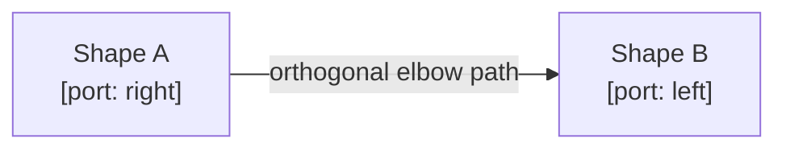

# 18 · Orthogonal Routing (Whiteboard Connectors)

> **What this document covers**: `orthogonal-routing.ts` — the math that makes whiteboard
> arrows/lines look like Eraser.io: port snapping, elbow (orthogonal) paths with rounded corners,
> and auto routing-style selection.

---

## 1. The Problem

When you draw an arrow between two shapes, it should:

1. **Snap** its endpoints to the closest *ports* (cardinal edges of a shape).
2. Route as an **orthogonal (elbow) path** with nice rounded corners — like a circuit diagram —
   instead of a diagonal line.
3. **Re-route automatically** when the shapes move.



---

## 2. Ports

Every shape has 4 ports, computed by `getShapePorts(el)` in `whiteboard-types.ts`:

```ts
[
  { port: 'top',    x: el.x + el.width / 2, y: el.y },
  { port: 'bottom', x: el.x + el.width / 2, y: el.y + el.height },
  { port: 'left',   x: el.x,                y: el.y + el.height / 2 },
  { port: 'right',  x: el.x + el.width,     y: el.y + el.height / 2 },
]
```

Connectors, pencils, and comments have **no ports** (return `[]`).

---

## 3. Port Snapping

### `findNearestShapePort(pt, elements, ignoreElementId?)`

Scans all shapes (ignoring the source), and:

1. Finds the port within **60px** of the pointer.
2. Also checks if the pointer is inside/near the shape's bounding box (16px threshold) — if so,
   snaps to that shape's optimal port.

```ts
export function findNearestShapePort(pt, elements, ignoreElementId?): ShapePortSnap | null {
  let closest: ShapePortSnap | null = null;
  let minDistance = 60;
  elements.forEach((el) => {
    if (el.id === ignoreElementId) return;
    if (isConnectorElement(el) || el.type === 'pencil' || el.type === 'comment') return;
    const ports = getShapePorts(el);
    ports.forEach((p) => {
      const dist = Math.hypot(pt.x - p.x, pt.y - p.y);
      if (dist < minDistance) { minDistance = dist; closest = { elementId: el.id, port: p.port, x: p.x, y: p.y }; }
    });
    // inside/near bounding box → snap to optimal port
    const isInsideShape = pt.x >= el.x - 16 && pt.x <= el.x + el.width + 16 &&
                          pt.y >= el.y - 16 && pt.y <= el.y + el.height + 16;
    if (isInsideShape) { /* getOptimalSinglePort + distance check */ }
  });
  return closest;
}
```

### `getOptimalSinglePort(el, pt)`

The port of a single element nearest to a point.

### `getOptimalPortPair(fromEl, toEl)`

Brute-forces all 4×4 port combinations and picks the pair with the **shortest distance** —
this is used when both ends are connected so the arrow always hugs the closest edges:

```ts
export function getOptimalPortPair(fromEl, toEl) {
  const portsA = getShapePorts(fromEl);
  const portsB = getShapePorts(toEl);
  let bestPair = { ..., minDist: Infinity };
  portsA.forEach((pA) => {
    portsB.forEach((pB) => {
      const dist = Math.hypot(pB.x - pA.x, pB.y - pA.y);
      if (dist < bestPair.minDist) bestPair = { fromPort: pA.port, fromPos: {x:pA.x,y:pA.y}, toPort: pB.port, toPos: {x:pB.x,y:pB.y}, minDist: dist };
    });
  });
  return bestPair;
}
```

---

## 4. The Orthogonal Path Algorithm

### `getDirectionalOrthogonalPathD(x1, y1, x2, y2, fromPort, toPort, cornerRadius, stubLength, waypoint?)`

This is the star of the file. It builds an SVG path string with:

- **Clearance stubs** — short straight segments leaving each port (`stubLength = 24`) so the arrow
  doesn't hug the shape edge.
- **Elbow routing** between the stubs with **rounded corners** (quadratic beziers, `cornerRadius = 12`).
- Four cases depending on port directions:

```ts
function getOriginalOrthogonalPathD(x1, y1, x2, y2, fromPort, toPort, cornerRadius, stubLength): string {
  // 1. Compute stub endpoints s1 (after fromPort) and s2 (before toPort)
  //    e.g. fromPort 'right' → s1x = x1 + stubLength
  //    e.g. toPort   'top'   → s2y = y2 - stubLength

  const isFromHorizontal = fromPort === 'left' || fromPort === 'right';
  const isToHorizontal   = toPort   === 'left' || toPort   === 'right';

  const parts: string[] = [`M ${x1} ${y1}`, `L ${s1x} ${s1y}`];

  if (isFromHorizontal && isToHorizontal) {
    // both leave horizontally → route through a vertical mid segment with rounded corners
    const midX = s1x + (s2x - s1x) / 2;
    // ... Q-curves for the corners
  } else if (!isFromHorizontal && !isToHorizontal) {
    // both leave vertically → route through a horizontal mid segment
  } else if (isFromHorizontal && !isToHorizontal) {
    // one horizontal, one vertical → single corner
  } else {
    // one vertical, one horizontal → single corner (mirrored)
  }

  parts.push(`L ${x2} ${y2}`);
  return parts.join(' ');
}
```

> **Beginner note**: the `parts` array is joined into a single SVG path `d` string. A quadratic
> curve `Q cx cy, x y` rounds a corner; the radius is clamped to the segment lengths so it never
> overshoots.

### Waypoints

If a `waypoint` is provided (user dragged the curved-arrow middle handle), a simpler 4-segment
path is emitted through the waypoint:

```ts
if (waypoint) {
  return `M ${x1} ${y1} L ${waypoint.x} ${y1} L ${waypoint.x} ${waypoint.y} L ${x2} ${waypoint.y} L ${x2} ${y2}`;
}
```

---

## 5. Curved Paths

### `getCurvedPathD(x1, y1, x2, y2, waypoint?)`

A cubic-bezier S-curve with control points offset perpendicular to the line:

```ts
const offset = dist * 0.35;
if (Math.abs(dx) >= Math.abs(dy)) {
  return `M ${x1} ${y1} C ${x1 + offset} ${y1}, ${x2 - offset} ${y2}, ${x2} ${y2}`;
} else {
  return `M ${x1} ${y1} C ${x1} ${y1 + offset}, ${x2} ${y2 - offset}, ${x2} ${y2}`;
}
```

---

## 6. Auto Routing Style

### `determineAutoRoutingStyle(fromPos, toPos, fromPort?, toPort?)`

Decides whether a freshly-drawn/rerouted arrow should be `straight` or `orthogonal`:

- Opposite horizontal ports (right↔left) that are vertically aligned (dy < 24) → **straight**.
- Opposite vertical ports (bottom↔top) that are horizontally aligned (dx < 24) → **straight**.
- Otherwise → **orthogonal**.

```ts
if (fromPort === 'right' && toPort === 'left' || fromPort === 'left' && toPort === 'right') {
  return dy < 24 ? 'straight' : 'orthogonal';
}
// fallback for unconnected endpoints: mostly-vertical/horizontal → straight
```

---

## 7. Small Helpers

| Function | Purpose |
|---|---|
| `inferCardinalDirection(x1, y1, x2, y2)` | Which port direction a free (unattached) endpoint should use |
| `getOppositePort(port)` | top↔bottom, left↔right (used when spawning a connected node on the far side) |
| `getArrowMidpoint(x1, y1, x2, y2, waypoint?)` | Midpoint for label placement (uses waypoint if present) |

---

## 8. Where It's Used

| Caller | Usage |
|---|---|
| `useWhiteboardInteractions` | `findNearestShapePort` while drawing arrows; `getOptimalPortPair` when both ends snap |
| `whiteboard-store.moveSelectedElements` / `resizeElement` | Re-routes connectors after shape moves/resizes |
| `WhiteboardElements.renderConnector` | Chooses `getDirectionalOrthogonalPathD` / `getCurvedPathD` for `routingStyle` |
| `WhiteboardOverlays` | Live previews of arrows while drawing / dragging endpoints |

---

## 9. Gotchas

- The orthogonal algorithm only kicks in when `routingStyle` is `orthogonal` — lines
  (`type: 'line'`) are always straight.
- Waypoints are cleared when routing style changes away from `curved` (in the store's
  `updateElement`).
- Port snapping radius (60px) and inside-shape threshold (16px) are magic numbers that tune the
  feel — adjust carefully, they affect ergonomics everywhere.
