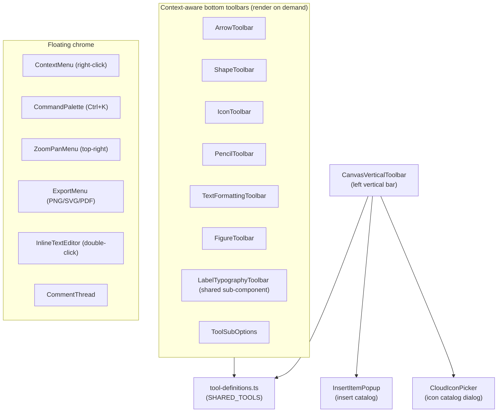

# 19 · Whiteboard Toolbars & UI Features

> **What this document covers**: every toolbar and floating UI feature of the whiteboard —
> the tool definitions, `ToolbarPanel` building blocks, context-aware toolbars, and standalone
> features like the command palette, comments, inline text editing, icon picker, and more.

---

## 1. The Toolbar Ecosystem



---

## 2. Tool Definitions — `tool-definitions.ts`

**File**: `src/lib/whiteboard/tool-definitions.ts`

The canonical list of tools shared between the top/side toolbars:

```ts
export interface ToolDefinition {
  tool: WhiteboardTool;
  label: string;
  shortcut?: string;
  icon: LucideIcon;
}

export const SHARED_TOOLS: ToolDefinition[] = [
  { tool: 'select',    label: 'Select',    shortcut: 'V', icon: MousePointer },
  { tool: 'rectangle', label: 'Rectangle', shortcut: 'R', icon: Square },
  { tool: 'circle',    label: 'Circle',    shortcut: 'O', icon: Circle },
  { tool: 'arrow',     label: 'Arrow',     shortcut: 'A', icon: MoveRight },
  { tool: 'line',      label: 'Line',      shortcut: 'L', icon: Minus },
  { tool: 'pencil',    label: 'Pencil',    shortcut: 'P', icon: Pencil },
  { tool: 'text',      label: 'Text',      shortcut: 'T', icon: Type },
  { tool: 'frame',     label: 'Figure',    shortcut: 'F', icon: Frame },
  { tool: 'comment',   label: 'Comment',   shortcut: 'C', icon: MessageSquare },
];
```

> If you add a new tool: add it to `WhiteboardTool` in `whiteboard-types.ts`, add it to
> `DRAWABLE_TOOLS`/`POLYGON_SHAPE_TYPES` as needed, and (optionally) add it here for the toolbar.

---

## 3. `CanvasVerticalToolbar` — the Left Vertical Bar

**File**: `src/components/canvas/CanvasVerticalToolbar.tsx`

A floating vertical pill on the left of the canvas:

1. **+ Insert item** button (opens `InsertItemPopup`, Ctrl+/).
2. **✨ Eraser AI** button (toggles AI chat sidebar).
3. Divider.
4. The `SHARED_TOOLS` buttons (sets `activeTool`).
5. **😊 Icons** button (opens `CloudIconPicker`).
6. Renders `InsertItemPopup` and `CloudIconPicker` modals when open.

---

## 4. `InsertItemPopup` — the Insert Catalog

**File**: `src/components/canvas/InsertItemPopup.tsx`

A popover with 4 categories (`insertItemCategory` in the workspace store):

| Category | Contents |
|---|---|
| **main** | AI Chat, Diagram as Code, Shape, Icon, Device Frame shortcuts |
| **shapes** | A 5-column grid of shape cards (rectangle → star) — click to activate the tool |
| **icons** | Searchable icon grid (React Query `useIconSearch`) — click to insert |
| **frames** | Browser / Phone device-frame buttons — **directly add** a frame element via `addElement` |

```tsx
const handleAddDeviceFrame = (frameType: 'browser' | 'phone') => {
  const id = `el-frame-${Date.now()}`;
  addElement({
    id, type: 'frame',
    x: 150, y: 150,
    width: frameType === 'browser' ? 500 : 280,
    height: frameType === 'browser' ? 320 : 520,
    title: frameType === 'browser' ? 'Browser Frame (localhost:3000)' : 'Mobile Phone Frame',
    strokeColor: 'var(--canvas-accent)', strokeWidth: 2,
  });
  setSelectedIds([id]); setActiveTool('select');
  onOpenChange(false);
};
```

It uses `useOnClickOutside` to close itself.

---

## 5. `ToolbarPanel.tsx` — Shared Building Blocks

**File**: `src/components/whiteboard/toolbars/ToolbarPanel.tsx`

Reusable pieces that keep the bottom toolbars consistent:

| Component | Purpose |
|---|---|
| `ToolbarPanel` | The floating bottom-center pill container (`fixed bottom-6 left-1/2 -translate-x-1/2`) |
| `ToolbarDivider` | A vertical 1px divider |
| `ToolbarButton` | A standard button with active state styling |
| `ToolbarColorPicker` | A color swatch button + popup grid of the 6 preset colors |
| `ToolbarMoreMenu` | A "⋯" dropdown: Duplicate / Copy / Bring to Front / Send to Back / Delete |

---

## 6. Context-Aware Toolbars

Each toolbar renders **only when relevant** (drawing tool active OR matching element selected):

### `ArrowToolbar` — arrows & lines

Color (presets + custom hex), routing style (orthogonal/curved/straight — arrows only), line width
(S/M/L/XL), start/end arrowheads (arrows only), line style (solid/dashed/dotted/dash-dot),
animated-flow toggle, label add/edit, label typography (`LabelTypographyToolbar`), label color,
and a "⋯" delete menu.

**Applying to selected elements**: every handler updates both the *active* style in the store and
any *selected* arrows:

```ts
const handleSelectColor = (colorKey) => {
  setActiveColor(colorKey);
  if (hasSelectedArrow) {
    selectedArrows.forEach((el) => updateElement(el.id, { strokeColor: c.border, arrowheadColor: c.border }));
  }
};
```

### `ShapeToolbar` — polygon shapes

Stroke/fill colors, line style, corner radius, fill style (plain/watercolor), line width, and more
menus. (Follows the same pattern as ArrowToolbar.)

### `IconToolbar` — cloud icons

Icon switcher (opens `CloudIconPicker`), color palette, add comment, and more actions
(duplicate/copy/layer/delete).

### `PencilToolbar` — pencil & eraser

Pencil/eraser buttons, 4 stroke-size dots (S/M/L/XL), color swatches + custom hex, and a more menu.

### `TextFormattingToolbar` — text & code elements

Font family (Rough/Clean/Mono), font size presets + stepper, text color, alignment, and mode
switching (text/code) for `TextElement`s. Uses `LabelTypographyToolbar` for shared typography UI.

### `FigureToolbar` — frames (figures)

Shows only when a single frame is selected: editable **title input**, **Copy Link** (copies the
page URL), **Zoom to Figure** (`fitToContent` on the frame bounds), **Add Comment**, and a
dropdown (duplicate/layer/delete).

### `LabelTypographyToolbar` — shared label styling

Font size stepper + presets, font family (Rough `Caveat`, Clean `Inter`, Mono `Courier New`),
text color, and alignment. Used by both ArrowToolbar and TextFormattingToolbar.

### `ToolSubOptions` — small per-tool popups

Renders next to the vertical toolbar for tools without a dedicated bottom bar (e.g. text size
presets, custom stroke/fill hex pickers).

> ℹ️ **Note**: `WhiteboardToolbar.tsx` is the *older* top toolbar — the codebase has migrated to
> `CanvasVerticalToolbar` + context toolbars. It may be dead code; check references before relying
> on it.

---

## 7. Standalone Features

### `ContextMenu` — right-click menu

**File**: `src/components/whiteboard/ContextMenu.tsx`

Position-clamped fixed menu with undo/redo, cut/copy/paste/duplicate, group/ungroup, align (6
directions, multi only), bring-to-front/send-to-back, and delete. Contexts: `'canvas' | 'element' | 'multi'`.
Closes on outside click or Escape.

### `CommandPalette` — Ctrl+K

**File**: `src/components/whiteboard/CommandPalette.tsx`

A searchable command modal with categories: Tools, Actions, View (themes/grid), Navigation.
Keyboard nav (↑/↓/Enter/Escape). Opens from `EraserHeader`.

```tsx
{ id: 'tool-rectangle', label: 'Rectangle', shortcut: 'R', icon: Square, category: 'Tools',
  action: () => setActiveTool('rectangle') },
```

### `ZoomPanMenu` — top-right view menu

**File**: `src/components/whiteboard/ZoomPanMenu.tsx`

Zoom percentage display + dropdown: `− % +` stepper, Hand tool (space), Zoom to fit (⇧1), Zoom to
selection (⇧2), Zoom to 100% (Ctrl 0), Hide UI (Ctrl \). When UI is hidden, shows a floating
"Show UI" button.

### `ExportMenu` — PNG/SVG/PDF

**File**: `src/components/whiteboard/ExportMenu.tsx`

- **PNG**: `html-to-image` `toPng(svg, { backgroundColor: '#ffffff', pixelRatio: 2 })`.
- **SVG**: plain `XMLSerializer` clone.
- **PDF**: `jsPDF` + `toPng` data URL.
- PNG has a canvas-drawing fallback if `toPng` throws.

### `InlineTextEditor` — double-click to edit

**File**: `src/components/whiteboard/InlineTextEditor.tsx`

A `<foreignObject>` overlaying the element with a textarea/input (or CodeMirror in code mode).
Adapts per element type: text (auto-grows via `computeTextElementSize`), shapes (label +
`computeShapeAutoHeight`), connectors (label at midpoint), frames (title). Finishes on blur/Escape.

### `CommentThread` — the comment system

**File**: `src/components/whiteboard/CommentThread.tsx`

A rich comment UI: pin anchor, draft mode, edit/delete, replies with `@mention` suggestions,
resolve/reopen, delete-confirm dialog, time-ago formatting. Data lives on the `CommentElement`
in the store (`text`, `author`, `replies[]`, `resolved`, `isDraft`, `createdAt`).

```tsx
// submitting a draft
const handleSubmitDraft = () => {
  if (!draftText.trim()) { deleteElements([element.id]); return; }
  updateElement(element.id, { text: draftText.trim(), author: 'User', isDraft: false, createdAt: element.createdAt || Date.now() });
};
```

### `ThemeToggle` — light/dark/system cycle

**File**: `src/components/whiteboard/ThemeToggle.tsx`

A single button that cycles light → dark → system using `next-themes`. Renders a neutral icon
until `mounted` to avoid hydration mismatch.

### `CloudIconPicker` — the icon catalog dialog

**File**: `src/components/whiteboard/CloudIconPicker.tsx`

Searchable grid of system-design icons (250+), powered by `useIconSearch` → `icon-catalog.ts`.
`onSelect(kind)` tells the caller which icon was picked. Reused by `CanvasVerticalToolbar`,
`IconToolbar`, and `WhiteboardToolbar`.

---

## 8. Icon Catalog — `icon-catalog.ts`

**File**: `src/lib/icons/icon-catalog.ts`

A curated registry of **system-design / cloud-architecture icons** from 4 sources:

| Source | How |
|---|---|
| `iconify` | ~70 hand-picked "logos:" ids (AWS, GCP, Azure, DBs, DevOps, languages) via `createIconifyComponent` |
| `simpleicons` / `grommet` / `tabler` | `react-icons` modules filtered by `isSystemDesignIcon()` keyword scan |

Key exports:

```ts
export const ICON_CATALOG: IconCatalogEntry[];            // flat list
export const ICON_MAP: ReadonlyMap<string, IconCatalogEntry>; // O(1) lookup by kind — use this in render paths!
export function searchIconsDynamic(query, maxResults): IconCatalogEntry[];
```

- `searchIconsDynamic` does substring matching, ranks exact > startsWith > includes, and can
  synthesize an **on-the-fly Iconify icon** (`logos:<query>`) when fewer than 5 matches.
- `useIconSearch` (in `src/lib/hooks/useIconSearch.ts`) wraps it in a React Query hook with a
  15-min cache.

---

## 9. `code-highlighter.tsx` — Code-Mode Rendering

**File**: `src/lib/whiteboard/code-highlighter.tsx`

`HighlightedCode` wraps CodeMirror (`@uiw/react-codemirror`) with the one-dark theme and heavy
custom CSS theming. Used for `TextElement`s in `mode: 'code'`:

- Captures wheel events (`stopPropagation`) so scrolling the code block doesn't pan the canvas.
- `readOnly` switches between display and editing modes.
- Monospace font, transparent background, custom scrollbar, 6px width.

---

## 10. Where to Add a New Feature

1. **New tool** → `whiteboard-types.ts` (+ `tool-definitions.ts` if it goes in the toolbar).
2. **New toolbar button** → pick the matching toolbar in `toolbars/` (or create one and mount it in
   `WhiteboardCanvas`).
3. **New floating dialog** → mount it in `WhiteboardCanvas` and reuse `useOnClickOutside` +
   shadcn `Dialog`.
4. **New command** → add an entry to `CommandPalette`'s `commands` array.
