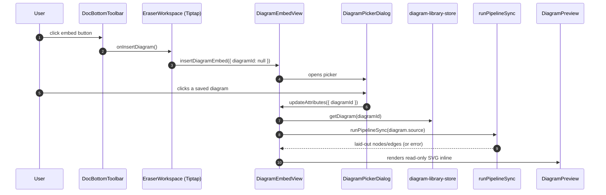
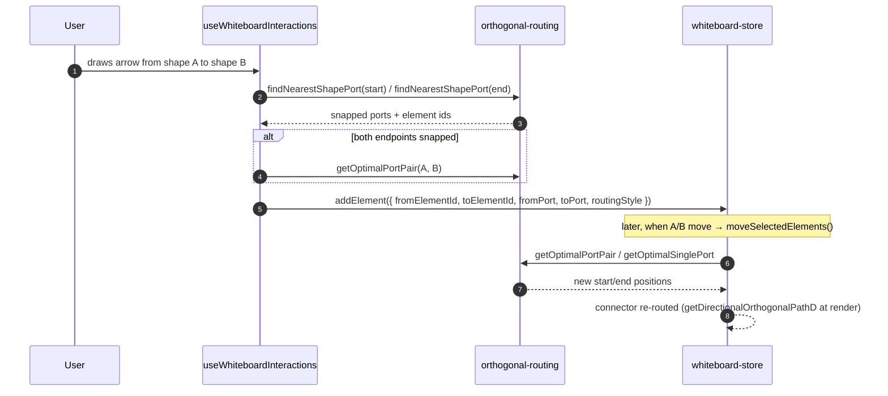
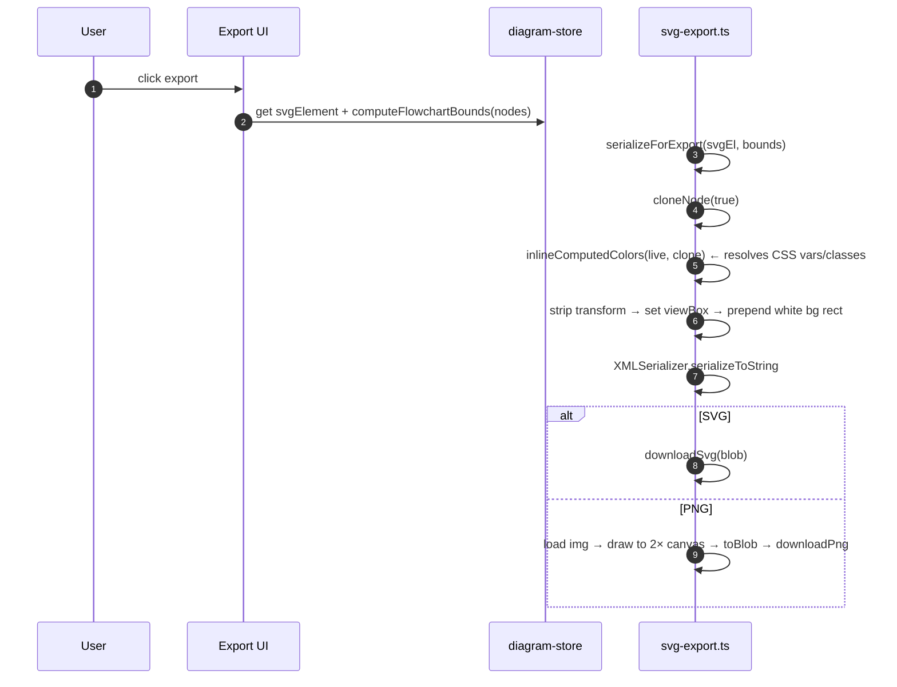
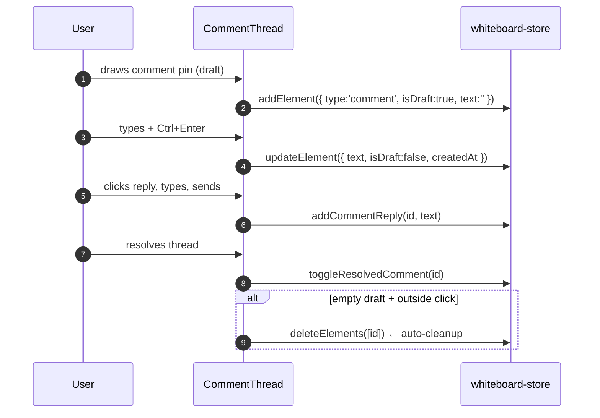
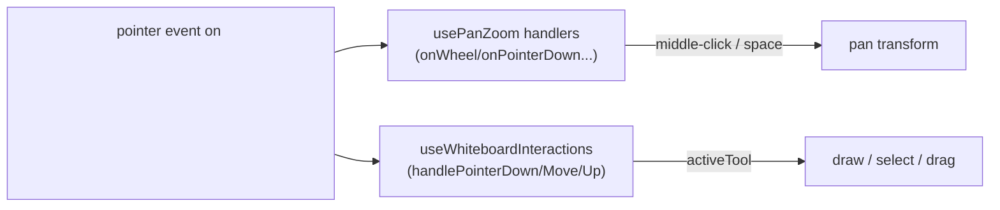
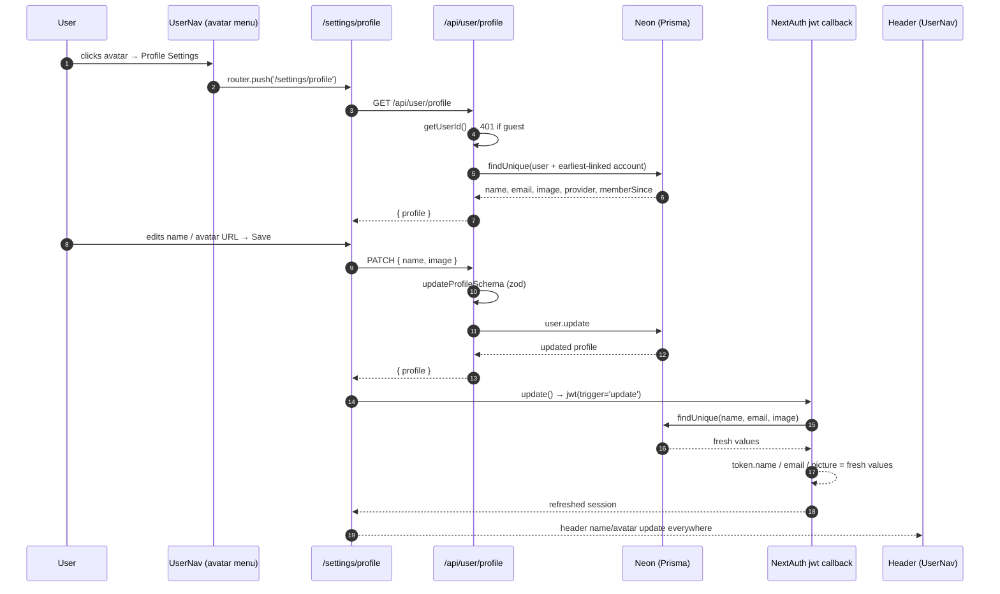

# 20 · Data Flows

> **What this document covers**: end-to-end walks through the app's most important flows —
> with sequence diagrams — so you understand how the pieces talk to each other.

---

## 1. Keystroke → Canvas (Diagram-as-Code)

The core loop of the diagram editor:

```mermaid
sequenceDiagram
    autonumber
    participant U as User
    participant CM as CodeMirror (CodeEditor)
    participant DS as diagram-store
    participant REG as diagram-registry
    participant H as usePipelineWorker
    participant W as pipeline.worker
    participant E as dsl + layout engine
    participant CV as Flowchart/Sequence Canvas

    U->>CM: types a character
    CM->>DS: setSource(newSource)
    DS-->>H: source subscription fires
    H->>REG: updateSource(currentDiagramId, source)
    H->>H: debounce 200ms; requestId++
    H->>W: postMessage({ id, source })
    W->>E: tokenize → parse → cstToAst → validate → layout
    E-->>W: PipelineDiagramResult or errors
    W-->>H: postMessage(response)
    H->>H: id === latestSentId? (stale guard)
    alt success
        H->>DS: applyResult(result, warnings)
        DS-->>CV: nodes/edges update → SVG re-renders
    else failure
        H->>DS: setErrors(errors)
    end
    H->>CM: pushDiagnostics(view, diagnostics)
```

**Key detail**: `applyResult` re-applies manual `nodeOverrides` onto fresh layout results so a
dragged node stays where the user put it.

---

## 2. Document Embed Preview (Docs tab)



---

## 3. Node Drag Override (Flowchart)

```mermaid
sequenceDiagram
    autonumber
    participant U as User
    participant NV as NodeView (FlowchartCanvas)
    participant DS as diagram-store
    participant CV as Canvas

    U->>NV: pointerdown on a node
    NV->>NV: capture start coords (node.x, node.y, pointer pos)
    U->>NV: pointermove
    NV->>NV: dx = (clientX - startX) / scale  ← zoom-corrected
    NV->>DS: setNodePosition(id, nodeX + dx, nodeY + dy)
    DS->>DS: nodeOverrides[id] = {x, y}; nodes updated
    DS-->>CV: node re-renders at new position
    DS-->>CV: edges re-render via straightEdgePath fallback
    U->>NV: double-click
    NV->>DS: resetNodePosition(id) → override removed, back to auto-layout
```

---

## 4. Whiteboard: Draw a Shape

```mermaid
sequenceDiagram
    autonumber
    participant U as User
    participant T as CanvasVerticalToolbar
    participant S as whiteboard-store
    participant INT as useWhiteboardInteractions
    participant WB as WhiteboardCanvas

    U->>T: click rectangle tool
    T->>S: setActiveTool('rectangle')
    U->>WB: pointerdown on canvas
    WB->>INT: handlePointerDown → setDrawingState({start})
    U->>WB: pointermove
    WB->>INT: update drawingState.current (live preview)
    U->>WB: pointerup
    INT->>INT: compute bbox from start/current (min 30px)
    INT->>S: addElement({ id, type:'rectangle', x, y, width, height, colors... })
    S->>S: pushHistory(prev elements); elements.push; saveElements (debounced)
    S-->>WB: element appears; selected
    INT->>S: setActiveTool('select')
```

---

## 5. Whiteboard: Arrow Between Two Shapes



---

## 6. SVG/PNG Export (Diagram Editor)



---

## 7. Undo/Redo (Whiteboard)

```mermaid
sequenceDiagram
    autonumber
    participant U as User
    participant S as whiteboard-store

    U->>S: addElement/updateElement/deleteElements...
    S->>S: pushHistory({ elements: PREVIOUS })
    S->>S: future = []
    Note over S: history[..., prev]; future[...]

    U->>S: undo()
    S->>S: previous = history.pop()
    S->>S: future.unshift({ elements: CURRENT })
    S->>S: elements = previous.elements

    U->>S: redo()
    S->>S: next = future.shift()
    S->>S: history.push({ elements: CURRENT })
    S->>S: elements = next.elements
```

History is capped at **100 entries**.

---

## 8. Comment Thread Flow



---

## 9. Pan/Zoom While Drawing (Whiteboard)

Pointer events go through **two layers**:



- `onWheel` is always the pan-zoom wheel handler (Ctrl = zoom, plain = smooth pan).
- `handlePointerDown` decides: middle-click/space/hand → pan (writes `transform`); otherwise →
  tool logic (draw/select/drag).
- Both share `svgRef` and `getCanvasCoords` so everything stays in canvas coordinates.

---

## 10. Reading State Outside React

Anywhere you need current store state without subscribing (event handlers, timers):

```ts
const state = useWhiteboardStore.getState();
state.moveSelectedElements(dx, dy);
```

This is used in `useWhiteboardInteractions` (e.g. `activeFillStyle` read at pointerup) and in
`usePipelineWorker` (reading `editorView` inside `onmessage`).

---

## 11. Profile Settings: Edit Display Name / Avatar

Signed-in users edit their profile (display name + avatar URL) from `/settings/profile`, reached
via the avatar menu. The save path updates the DB **and** refreshes the NextAuth session so the
header reflects the change everywhere without a reload:



**Key details**:

- **Guest guard** — `getUserId()` returns `null` for signed-out visitors, so both GET and PATCH
  answer `401`, and the page shows a "Sign in to manage your profile" card instead of the form.
- **Validation** — `updateProfileSchema` trims `name` (must be 1–80 chars) and accepts an avatar
  URL or an **empty string to clear** the image (`image: ''` → `null` in the DB).
- **Session refresh** — after a successful PATCH the page calls `update()` from `useSession()`,
  which re-runs the NextAuth `jwt` callback with `trigger: 'update'`. The callback re-reads the
  DB (wrapped in `try/catch`, so sessions survive a DB outage) and the refreshed session updates
  the header instantly.

> Full auth/database context: [24-authentication-and-database.md](24-authentication-and-database.md) §6.
