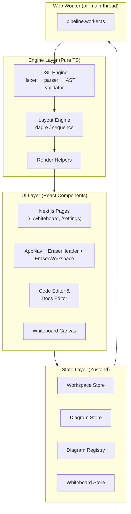

# 📚 Eraser.io Clone — Developer Documentation

Welcome, developer! 👋 This folder contains **modular, beginner-friendly documentation** for the
Eraser.io Clone codebase. Each document covers **one feature** in detail, with mermaid diagrams,
code snippets, and plain-English explanations.

> **Start here.** Read the docs in order (01 → 22), or jump straight to the feature you're
> working on using the index below. Every link below opens the matching file.

---

## 🗺️ Documentation Index

| # | Document | What you'll learn |
|---|----------|-------------------|
| 01 | [Getting Started](01-getting-started.md) | Prerequisites, install, run the dev server, first steps |
| 02 | [Architecture Overview](02-architecture-overview.md) | High-level system design, tech stack, module boundaries |
| 03 | [Project Structure](03-project-structure.md) | The complete `src/` folder tree, explained folder by folder |
| 04 | [Routing & Pages](04-routing-and-pages.md) | Next.js App Router pages (`/`, `/dashboard/all`, `/workspace/[id]`, `/whiteboard`, `/settings`) |

| 05 | [App Shell & Navigation](05-app-shell-navigation.md) | `AppNav`, `EraserHeader`, `EraserWorkspace` layout |
| 06 | [State Management (Zustand Stores)](06-state-management.md) | All 5 Zustand stores — what they hold and why |
| 07 | [Diagram DSL Engine](07-dsl-engine.md) | Lexer → Parser → AST → Validator (the "Diagram-as-Code" core) |
| 08 | [Web Worker Pipeline](08-worker-pipeline.md) | `pipeline.worker.ts`, `usePipelineWorker`, debounce & stale-guard |
| 09 | [Code Editor (CodeMirror)](09-code-editor.md) | DSL syntax highlighting, linting, diagnostics |
| 10 | [Layout Engine](10-layout-engine.md) | Dagre auto-layout, sequence layout, text measurement & wrapping |
| 11 | [Diagram Rendering](11-diagram-rendering.md) | `FlowchartCanvas`, `SequenceDiagramCanvas`, `NodeIcon`, edge geometry |
| 12 | [SVG & PNG Export](12-svg-export.md) | `svg-export.ts` — serialize, inline colors, download |
| 13 | [Docs Editor (Tiptap)](13-docs-editor.md) | Rich-text editor, diagram embeds, slash commands |
| 14 | [Whiteboard Core](14-whiteboard-core.md) | `whiteboard-types.ts`, `whiteboard-store.ts` (the heart of the canvas) |
| 15 | [Whiteboard Canvas & Rendering](15-whiteboard-canvas.md) | `WhiteboardCanvas`, `WhiteboardElements`, `WhiteboardOverlays` |
| 16 | [Whiteboard Interactions](16-whiteboard-interactions.md) | `useWhiteboardInteractions` — drawing, dragging, keyboard shortcuts |
| 17 | [Pan & Zoom](17-pan-zoom.md) | `usePanZoom` — scroll pan, pinch zoom, fit-to-content |
| 18 | [Orthogonal Routing](18-orthogonal-routing.md) | Port snapping & elbow connector paths for arrows |
| 19 | [Whiteboard Toolbars & UI](19-whiteboard-toolbars.md) | Tool definitions, `ToolbarPanel`, context menu, command palette |
| 20 | [Data Flows](20-data-flows.md) | End-to-end flows: keystroke→canvas, export, undo/redo, etc. |
| 21 | [Development Guide](21-development-guide.md) | Coding rules, verification commands, common pitfalls |
| 22 | [Testing Guide](22-testing-guide.md) | One reference for the test workflow, conventions & coverage gate |
| 23 | [Shared UI Primitives](23-shared-ui-primitives.md) | `AppButton`, `StatusDot`, `SyncStatusBadge` & the emerald/amber/red color language |
| 24 | [Auth, Database & Cloud Persistence](24-authentication-and-database.md) | NextAuth OAuth, Prisma/Neon schema, document API routes, share flow, profile settings, proxy, env vars |

---

## 🧭 Quick Orientation



## 🧩 Quick Facts

- **Stack**: Next.js 16 · React 19 · TailwindCSS v4 · Zustand v5 · Chevrotain · Dagre · CodeMirror 6 · Tiptap
- **Three products in one app**: Diagram-as-Code editor, Markdown-style Docs editor, and a Freeform Whiteboard.
- **State** lives in 6 small Zustand stores (see [06-state-management.md](06-state-management.md)).
- **Heavy parsing work** happens in a Web Worker so the UI never freezes (see [08-worker-pipeline.md](08-worker-pipeline.md)).
- **The DSL engine** (`src/lib/dsl/` + `src/lib/layout/`) is *pure TypeScript* — no React, no DOM.

---

## 🚀 30-Second Quickstart

```bash
# 1. Install dependencies
npm install

# 2. Start the dev server
npm run dev

# 3. Open the app
# http://localhost:3000  → redirects to /whiteboard
```

Then open [01-getting-started.md](01-getting-started.md) for the full setup walkthrough.

---

## 🤝 How to Use This Documentation

1. **New to the project?** Read 01 → 06 first. That gives you the big picture before any code.
2. **Working on a diagram feature?** Read 07 → 12.
3. **Working on the whiteboard?** Read 14 → 19.
4. **Lost on how things connect?** Read [20-data-flows.md](20-data-flows.md).
5. **About to write code?** Read [21-development-guide.md](21-development-guide.md) for the rules.
6. **Writing or running tests?** Read [22-testing-guide.md](22-testing-guide.md) for the workflow & coverage gate.

> 💡 **Tip for contributors**: when you change the behavior of a file, update the matching doc
> in this folder so the documentation never drifts from the code.
