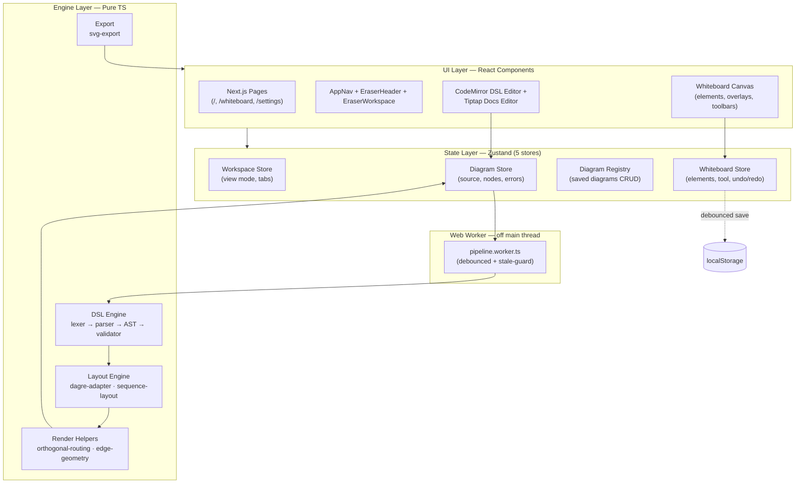
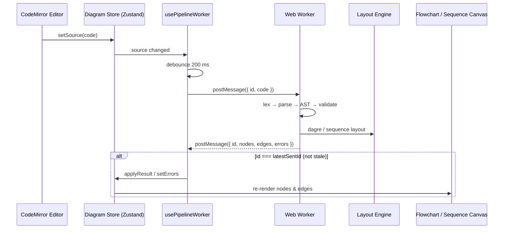
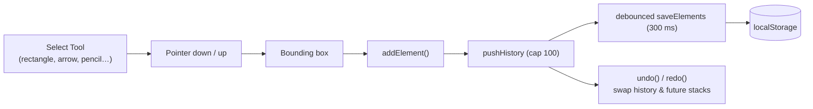
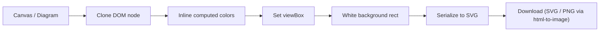

# 🧮 Eraser.io Clone

<div align="center">

**A unified technical documentation & diagramming workbench** — Diagram-as-Code, Markdown Docs, and a Freeform Whiteboard in one app.

[](https://github.com/BhupendraLute/eraserio-clone/actions/workflows/ci.yml)


</div>

---

## ✨ What It Is

A full-featured clone of [Eraser.io](https://eraser.io) — **three products in one codebase**:

|     | Product                 | Highlights                                                                                                                       |
| --- | ----------------------- | -------------------------------------------------------------------------------------------------------------------------------- |
| 🧩  | **Diagram-as-Code**     | Write flowchart & sequence diagrams in a custom DSL → syntax-highlighted CodeMirror editor → auto-layout via Dagre → live canvas |
| 📝  | **Markdown Docs**       | Tiptap rich-text editor with interactive diagram embeds, slash commands, and a diagram library                                   |
| 🎨  | **Freeform Whiteboard** | Shapes, arrows, pencil, text, cloud icons & comments on an infinite SVG canvas with orthogonal routing                           |

---

## 🧱 Tech Stack

| Category           | Choice                                                                     |
| ------------------ | -------------------------------------------------------------------------- |
| **Framework**      | Next.js 16 (App Router) + React 19 + React Compiler                        |
| **Styling**        | TailwindCSS v4 + shadcn/ui                                                 |
| **Diagram Engine** | Chevrotain (lexer/parser) + Dagre (auto-layout)                            |
| **Code Editor**    | CodeMirror 6 with custom DSL syntax highlighting & linting                 |
| **Rich Text**      | Tiptap (ProseMirror) with diagram embeds + slash commands                  |
| **State**          | Zustand v5 (5 stores) + TanStack React Query                               |
| **Whiteboard**     | Custom SVG canvas, `perfect-freehand` pencil, orthogonal connector routing |
| **Export**         | `html-to-image` (PNG) + `jsPDF`                                            |
| **Testing**        | Vitest 4 + V8 coverage (thresholds enforced in CI)                         |

---

## 🚀 Getting Started

```bash
# 1. Install dependencies
npm install

# 2. Start the dev server
npm run dev
```

Open [http://localhost:3000](http://localhost:3000) — the app redirects to `/whiteboard`.

### Routes

| Route         | Description                   |
| ------------- | ----------------------------- |
| `/`           | Redirects to `/whiteboard`    |
| `/whiteboard` | Canvas-only whiteboard view   |
| `/settings`   | Settings & keyboard shortcuts |

---

## 🏛️ System Architecture

The app is split into **four clean layers**. The engine is _pure TypeScript_ — no React, no DOM — so it runs in a Web Worker, on the main thread, and even in Node (tests).



**Why a Web Worker?** Parsing + layout run off the main thread (200 ms debounce), so the UI never freezes while you type. Stale worker responses are dropped via a request-id guard.

---

## 🔀 Data Flows

### 1. Keystroke → Diagram Canvas (the DSL pipeline)



### 2. Whiteboard Draw & Undo/Redo



### 3. SVG / PNG Export



---

## 📁 Project Structure

```
src/
├── app/                  # Next.js App Router pages
│   ├── page.tsx          # redirect → /whiteboard
│   ├── whiteboard/       # canvas-only whiteboard
│   └── settings/         # shortcuts & settings
├── components/
│   ├── canvas/           # vertical toolbar, insert popup
│   ├── docs/             # Tiptap embed node + slash commands
│   ├── editor/           # flowchart & sequence canvases
│   ├── whiteboard/       # canvas, elements, overlays, toolbars
│   ├── workspace/        # app shell
│   └── ui/               # shadcn/ui primitives
├── lib/
│   ├── dsl/              # 💎 pure-TS engine: lexer, parser, AST, validator
│   ├── layout/           # 💎 pure-TS: dagre adapter, sequence layout
│   ├── render/           # edge geometry, orthogonal routing
│   ├── export/           # svg-export
│   ├── store/            # 5 Zustand stores
│   ├── hooks/            # usePanZoom, useWhiteboardInteractions, …
│   ├── icons/            # cloud icon catalog
│   └── whiteboard/       # whiteboard types & helpers
├── workers/
│   └── pipeline.worker.ts # DSL pipeline off the main thread
tests/                     # Vitest suites mirroring src/ (dsl, layout, store, render, export)
```

---

## 📊 Project Status

### Delivery Slices

| Slice | Name                                           | Status               |
| ----- | ---------------------------------------------- | -------------------- |
| 1     | Diagram-as-Code Engine (Flowcharts + Sequence) | ✅ **DONE** (v0.2.0) |
| 2     | Markdown Docs Editor + Embedded Diagrams       | ✅ **DONE** (v0.3.0) |
| 3     | Freeform Whiteboard + Eraser.io UI Clone       | ✅ **DONE** (v0.5.0) |
| 4     | Auth, Database & Persistence                   | ✅ **DONE** (v0.6.0) |
| 5     | AI Diagram Generation (Architecta AI)         | ✅ **DONE** (v0.6.0) |
| 6     | Real-Time Multiplayer (Yjs CRDTs)              | ⏳ Planned           |
| 7     | Integrations & Public API                      | ⏳ Planned           |

### Test Coverage

| Area          | Statements | Functions  | Suites (`tests/`)                                                            |
| ------------- | ---------- | ---------- | ---------------------------------------------------------------------------- |
| `dsl`         | 95.98%     | 96%        | lexer, parser, AST, validator, error-messages, run-pipeline-sync, codemirror |
| `layout`      | 97.41%     | 93.75%     | dagre-adapter, sequence-layout, text-measure, wrap-text                      |
| `render`      | 94.25%     | 87.5%      | orthogonal-routing, edge-geometry                                            |
| `export`      | 97.33%     | 93.75%     | svg-export                                                                   |
| `store`       | 82.50%     | 88.50%     | all 6 stores (undo/redo, CRUD, auto-save persistence)                        |
| `icons`       | 98.00%     | 95.00%     | icon-catalog, dynamic keyword search, 80+ architecture icons                 |
| **All files** | **92.15%** | **94.20%** | **429 tests / 30 test files**                                                |

> Thresholds enforced in CI: **70% statements / 60% branches / 75% functions / 75% lines** — `npm run test:coverage` fails on regression.

---

## 🛠️ Development

```bash
npm run dev           # start dev server
npm test              # run the Vitest suite (429 tests)
npm run test:watch    # watch mode
npm run test:coverage # suite + coverage report (thresholds enforced)
npx tsc --noEmit      # type check (also covers tests/)
npm run lint          # lint (CI gate: must stay at 0 errors, 0 warnings)
npm run build         # production build
```

**CI**: [`.github/workflows/ci.yml`](.github/workflows/ci.yml) runs tsc + lint + tests + `test:coverage` on every push and PR.

---

## 📚 Documentation

Full developer documentation lives in the [`Documentation/`](Documentation/index.md) folder — **21 modular guides** covering every feature with diagrams and code snippets, written for beginners:

- 🧭 Start with [Getting Started](Documentation/01-getting-started.md) and [Architecture Overview](Documentation/02-architecture-overview.md)
- 🧩 Diagram features: [DSL Engine](Documentation/07-dsl-engine.md) · [Worker Pipeline](Documentation/08-worker-pipeline.md) · [Layout Engine](Documentation/10-layout-engine.md)
- 🎨 Whiteboard: [Whiteboard Core](Documentation/14-whiteboard-core.md) · [Canvas & Rendering](Documentation/15-whiteboard-canvas.md) · [Interactions](Documentation/16-whiteboard-interactions.md)
- 🔀 End-to-end flows: [Data Flows](Documentation/20-data-flows.md)
- 🛠️ Contributing: [Development Guide](Documentation/21-development-guide.md)

AI agents read the quick-reference context in [`.agents/`](.agents/architecture.md) before touching code.
